# Seaside Sewing


Seaside Sewing is a full stack e-commerce website built using Django, Python, HTML, CSS and JavaScript. The website utilises Stripe as the payment processor.

This project was created as my fourth milestone project for my Level 5 Diploma in Web Application Development with the Code Institute.

[Visit Seaside Sewing Here](https://seaside-sewing.herokuapp.com/)

   

---

## Contents

* [User Experience](#user-experience)
  * [Strategy Plane](#strategy-plane)
    * [Project Goals](#project-goals)
  * [Scope Plane](#scope-plane)
    * [Feature Planning](#feature-planning)
  * [Structure Plane](#structure-plane)
    * [User Stories](#user-stories)
    * [Database Schema](#database-schema)
  * [Skeleton Plane](#skeleton-plane)
    * [Wireframes](#wireframes)
  * [Surface Plane](#surface-plane)
    * [Colour Scheme](#colour-scheme)
    * [Typography](#typography)
    * [Imagery](#imagery)
    * [Base Mockup](#base-mockup)
* [Features](#features)
  * [General Features of The Site](#general-features-of-of-the-site)
  * [Future Implementations](#future-implementations)
  * [Accessibility](#accessibility)
* [Technologies Used](#technologies-used)
  * [Languages Used](#languages-used)
  * [Database Used](#database-used)
  * [Frameworks Used](#frameworks-used)
  * [Libraries & Packages Used](#libraries--packages-used)
  * [Programs Used](#programs-used)
  * [Stripe](#stripe)
* [Deployment & Local Development](#deployment--local-development)
  * [Deployment](#deployment)
  * [Local Development](#local-development)
    * [How to Fork](#how-to-fork)
    * [How to Clone](#how-to-clone)
* [Testing](#testing)
* [Credits](#credits)
  * [Code Used](#code-used)
  * [Content](#content)
  * [Media](#media)
  * [Acknowledgments](#acknowledgments)

---

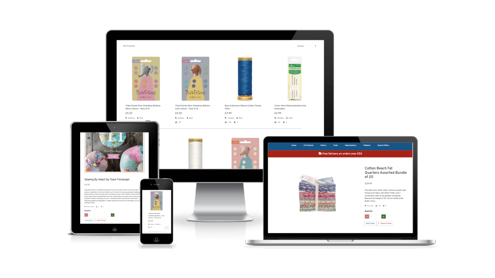

---

## User Experience

### Strategy Plane

#### **Project Goals**

Seaside Sewing is a Business to Consumer (B2C) e-commerce site.

The sites primary audience will be people who have a love of sewing and quilting. It will cater to a range of sewers from beginners through to experts, by selling a range of items over different price points. Seaside Sewing aims to allow customers to purchase all their requirements for their projects on one website. As a sewist myself, I know that there is a large group of people who would utilise a site like this.

In recent years, the advent of social platforms like YouTube and Pinterest have made it even easier for people to take up the hobby and, of course a BBC show called The Great British Sewing Bee has help a resugence of the hobby. [Research](https://www.theguardian.com/lifeandstyle/2017/jan/27/a-stitch-in-time-new-era-for-home-sewing) has shown that between 2014 and 2017, more than 1 million people took up sewing. The Craft & Hobby Trade Association estimates there now around 7 million people in the UK who sew their own clothes.

### Scope Plane

#### **Feature Planning**

Below is a table of opportunities for the project, together with a score of their importance level and viability (rated low to high, 1-5). Products that score highly on importance and viability will be features that must be addressed first as part of the MVP. Features that are scored mid range are should have features, which will be added to the project once it has achieved MVP status. Low scored features, are could have features and if not attended to in this development version will be marked to be addressed in a future version.

User roles are included in this project as there are different features of the site dependant on what type of user you are. There are three categories of user for the site, guest users (those who do not have an account), Users (who have signed up and verified their account) and Admins (users who have superuser status and are able to perform additional tasks on the site reserved for shop owners, such as adding new products.) Admins are also able to use their accounts in the same way a user would, such as purchasing items.

|User Type | Feature | Importance | Viability |  | Delivered |
| :--- | :--- | :---: | :---: | :---: | :---: |
| | User roles | 5 | 5 | MVP | ✅ |
| Guest | Sign up for an account | 4 | 5 | MVP | ✅ |
| User & Admin | Account Profile | 4 | 5 | MVP | ✅ |
| User | Password recovery | 5 | 5 | MVP | ✅ |
| Guest | Use social media to sign up/log in | 2 | 4 | | |
| User & Admin | Search and filter through products | 5 | 5 | MVP | ✅ |
| All | Checkout system | 5 | 5 | MVP | ✅ |
| Guest | Checkout without needing an account | 3 | 4 | | ✅ |
| | Payment Via Stripe | 5 | 5 | MVP | ✅ |
| All | Receive email confirmation for order | 5 | 5 | MVP | ✅ |
| User & Admin | Order History | 4 | 5 | | ✅ |
| Admin | Add product | 5 | 5 | MVP | ✅ |
| Admin | Edit/update product | 5 | 5 | MVP | ✅ |
| Admin | Delete product | 5 | 5 | MVP | ✅ |
| Admin | Basic Stock management | 2 | 3 | | ✅ |
| Admin | Sales Reporting | 1 | 2 | | |
| | Terms and Conditions | 3 | 5 | | ✅ |
| | Privacy Policy | 3 | 5 | | ✅ |
| | Delivery Terms | 3 | 5 | | ✅ |
| | Social Media Links | 3 | 5 | | ✅ |
| All | Contact form | 3 | 3 | | ✅ |
| Newsletter | 2 | 3 | | |
| User | Wishlist | 3 | 3 | | |
| User | Create Product Reviews | 3 | 3 | | |
| User | Read Product Reviews | 3 | 3 | | |
| | Blog | 1 | 3 |  | |
| | Discount Vouchers | 1 | 1 | | |

### Structure Plane

#### **User Stories**

| User Story ID | As a/an | I want to be able to ... | So that I can... |
| :--- | :--- | :--- | :---|
| **VIEWING & NAVIGATION** |
| 1 | Shopper | Easily navigate the site | Find products/information that I am require |
| 2 | Shopper | View a category of products/filter products | Find specific items I am interested in without having to scroll through all products |
| 3 | Shopper | View more detail on products | to make an informed decision of if the item suits my requirements |
| 4 | Shopper | View items on clearance/sale easily | Save money  |
| 5 | Shopper | View my running total of purchases throughout my visit | Make sure I don't overspend & am able to track whether I meet any thresholds for site offers (e.g. free delivery) |
| 6 | Shopper | View the items I currently have selected for purchase | to enable me to check I still wish to purchase the items, or amend quantities if required |
| 7 | Shopper | View ratings for products | make informed decisions about purchasing products |
| **REGISTRATION & USER ACCOUNTS** |
| 8 | Shopper | Register for an account | Have an account with the site and view my profile |
| 9 | Shopper | Receive an email to confirm my registration | Verify my account was created successfully |
| 10 | Shopper | Log in and out | Keep my account information secure |
| 11 | Shopper | View a profile page | Set a default delivery address and view previous purchases |
| 12 | Shopper | Reset my password | Recover my account |
| **SORTING & SEARCHING** |
| 13 | Shopper | Sort the list of available products | Easily identify the best rated, best priced and categorically sort products |
| 14 | Shopper | Sort a specific category of products | Find the best-priced or best-rated product in a specific category, or sort the products in that category by name |
| 15 | Shopper | Sort multiple categories of products simultaneously | Find the best-priced or best-rated products across broad categories, such as fabric or haberdashery |
| 16 | Shopper | Search for a product by name or description | Find a specific product I'd like to purchase |
| 17 | Shopper | Easily see what I've searched for and the number of results | Quickly decide whether the product I want is available |
| **PURCHASING & CHECKOUT** |
| 18 | Shopper | Easily select the quantity of a product when purchasing it | Ensure I don't accidentally select the wrong product quantity |
| 19 | Shopper | View items in my bag to be purchased | Identify the total cost of my purchase and all items I will receive |
| 20 | Shopper | Adjust the quantity of individual items in my bag | Easily make changes to my purchase before checkout |
| 21 | Shopper | Easily enter my payment information | Check out quickly and with no hassles |
| 22 | Shopper | Feel my personal and payment information is safe and secure | Confidently provide the needed information to make a purchase |
| 23 | Shopper | View an order confirmation after checkout | Verify that I haven't made any mistakes |
| 24 | Shopper | Receive an email confirmation after checking out | Keep the confirmation of what I've purchased for my records |
| **ADMIN & STORE MANAGEMENT** |
| 25 | Store Owner | Add a product | Add new items to my store |
| 26 | Store Owner | Edit/update a product | Change product prices, descriptions, images and other product criteria |
| 27 | Store Owner | Delete a product | Remove items that are no longer for sale |

#### **Database Schema**

Due to the data being used for the project I have opted to use a relational database as this will best suit my requirements.

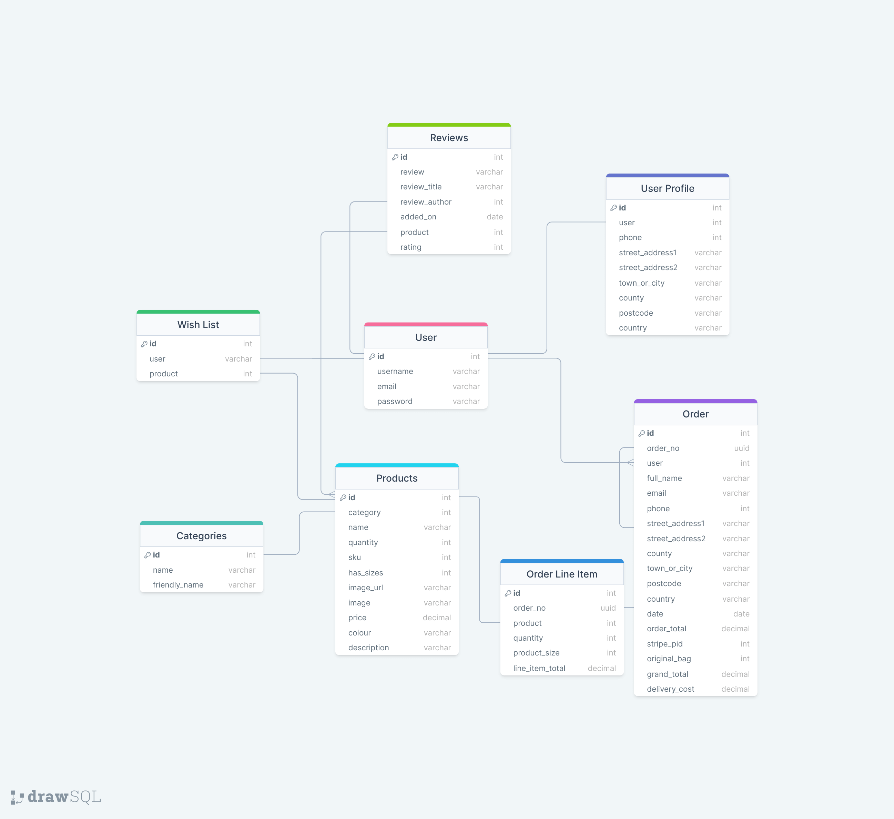

After my initial meeting with my mentor, it was advised that I adjust the database schema slightly to normalise it. This basically means not having data in two places - as the data can be called from the first table. I therefore adjusted my user table to include the users full name, phone number and address details and removed this from the user profile. I have done the same with the users information that was duplicated in the order table, as the information can be called from the user table when required. upon reflection, I didn't see the need for sizes for the products and so have removed this column from the products table.

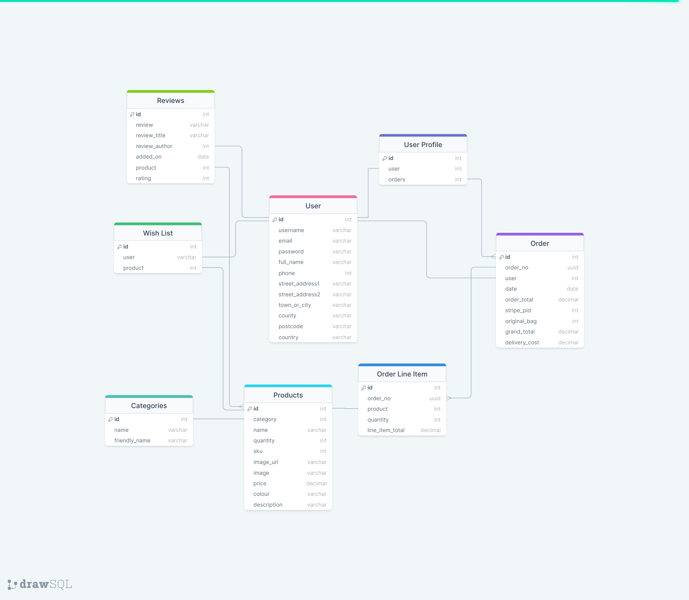

I ran into an issue in that I had already made the initial app for the project and run the initial migrations, so therefore was unable to amend the user table, and on taking some advice from peers it was suggested best not to alter the user table. I have therefore gone ahead with the UserProfile table to hold the users information and this shares a one to one relationship with the User table. I have omitted the wish list and reviews tables due to not including them in the project at this stage. I have added the contact table which houses the contact forms sent to the shop.

Database Schema V3 to go here

### Skeleton Plane

#### **Wireframes**

Wireframes for the project were created using [Balsamiq](https://balsamiq.com/)

* Base Template - This template contains the header and footer which are used throughout the website. This template is used as a base and then other pages content will be injected into main section using django template language.

  

* Home Page

  

* Register Page - The register page will allow users to register for an account with Seaside Sewing in one of two ways - registering for an account with a username/email or via a social account.

  The username/email path will require users to choose a username, a password which will be entered twice to confirm the user hasn't made an error when entering the password and their email address, which again will be required to be entered twice to confirm there are no mistakes in the users input.

  The social media account path will allow users to sign up for an account on Seaside Sewing by using a social media account.

  

* Login Page - The login page will allow users to sign into their account with either their username, or using their linked social account.

  

* Logout Page - The logout page will ask the user to confirm they wish to logout. If the user clicks the logout button they will be logged out of their account and redirected to the home page.

  

* Profile Page - The profile page displays a users default delivery information, and if they have previously made any orders using their account, their past purchases will also be displayed. The user can click on the order No for their previous orders and they will be taken to a detailed view of that previous order.

  

* Bag Page (Empty Bag) - The bag page will display the following message to users if there are no products in their bag.

  

* Bag Page - When a user has items in their bag, they will be shown an image of the item, the title

  

* Wish list (empty wish list) - The wish list page will display a message to the user to let them know there are no products currently in their wish list and will give instructions on how to add a product to their wish list. There will also be a button that redirects the user to the products page.

  

* Wish list Page - The wish list page is very similar in layout to the bag page. It displays an image of the item, the title,selected size and sku for the product along with the product price. There is also has a button to remove the product from their wish list. The user can add an item from their wish list to their bag by clicking on the product which will take them to the product details page where they can select sizes and quantity.

  

* Checkout Page - The checkout page requires the user to fill in their details, along with a delivery address. They are given the option via a checkbox to save the information they input to their profile. If the user has already filled in their information in their profile, the form will be pre-populated with this information.

  Underneath the users delivery information will be the payment input where the user will be required to enter their card information. If there are any errors with this input, an error message will be displayed under the input. Beneath this are the complete order buttons (which has a small message underneath it to let the user know the amount being charged to their card) and a button which redirects users back to their bag to amend their order.

  The user will also be shown a summary of the products they are purchasing. This consists of an image of the product, the title of the product, a size if applicable, the quantity they are purchasing and the subtotal for that product. Underneath the summary are the subtotal, delivery costs and grand total.

  

* Payment Processing Overlay - once the user has submitted correct payment details and clicks on the button to complete their order a payment processing overlay with an animated spinner will be displayed over the checkout page while payment is processed. Once this has processed, the user will be shown the checkout success page.

  

* Checkout Success -

  

* Products - The products page will display an image for each item along with the title for item, price, category and rating underneath. Screen size will determine how many products are displayed in a row.

  

* Products (Admin View) - The Admin view of the products page is identical to that for a user, except for the addition of an edit and delete button below each item. This will allow the admin to be able to edit or delete products easily from the products view page.

  

* Product Detail - The product detail page features an image of the product, along with the title, price, category and rating for the product.

  There is also a text description of the product which gives further information to the user to enable them to decide if the product meets their needs.

  Underneath the description is a quantity box for the user to select how many of the product they would like to purchase, along with an add to wish list button.

  The Add to bag button and back to products buttons are placed below.

  

* Product Detail (Admin View) - The admin view of the product detail page is identical to the product detail page, except for the addition of the edit and delete buttons to allow the admin to edit and delete a product directly from their details page.

  

* Edit Product - The Edit product page is only available to admin users. It displays a form with the products details pre-populated ready for the admin to edit. The admin may also delete the current image or choose a new image to upload and display.

  

* Delete Product - The Delete product page is only available to admin users. Its displays the product image, title, category and SKU along with a message asking the admin if they are sure they want to delete the product. It also warns them that this action cannot be undone. They are given a cancel button and a delete button.

  

* 404 Error - The 404 page lets the user know there has been a problem and displays a button to redirect them to the products.

  

* Privacy Policy - The privacy policy page contains the privacy policy for the site.

  

* Terms & Conditions - The terms & conditions page contains the terms and conditions for the site.

  

* Delivery Information - The delivery page contains further information for the user on delivery options.

  

* Add review - If a user wants to add a review for a product, they will be redirected to the add review page. This will display the name of the product along with an image they would like to review. They are then given an input field to create a title for their review and a text area for the actual review. Underneath this will be a rating for the product along with a cancel and submit review button.

  

* Toasts - Toasts are used to display messages to the user depending on their actions on the site. They can let users know if an action has been successful, if there has been an error or for displaying a general message. This is also reflected in the colour at the top of the toast. Toasts will also be used to display to a user what they currently have in their bag when they add a new product. Toasts can be dismissed by clicking the X on the toast.

  

### Surface Plane

#### **Colour Scheme**

I have based the colour theme for the site around the main image used at the top of the site, a lighthouse on an island surrounded by water. The shades of blue fit nicely with a seaside theme, the red gives and green nice contrast to the blue, and will be perfect to use as part of the toasts.

Text throughout the site will be either black or white, depending on the background colour.

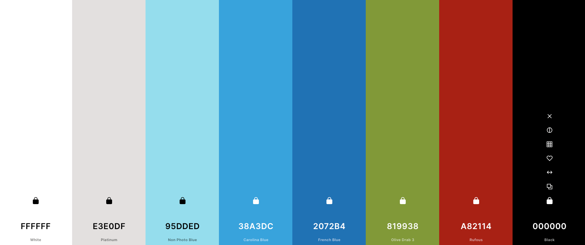

UPDATE

Once I began working on the site, I realised that there wasn't enough of a contrast for the green text on a white background when running the site through the WAVE chrome extension. I have therefore used a slightly darker green to allow for a better contrast. There was a similar issue with the dark blue chosen for the site, the contrast was not passing for the sites header with white text, and so I have chosen a darker blue which does pass contrast tests with white text. I have also updated the grey colour used, as this was a colour used for other elements in bootstrap, so by changing to this allows a better cohesion in the site.

As I did not appear to be using the medium blue anywhere in the site, I have removed this.

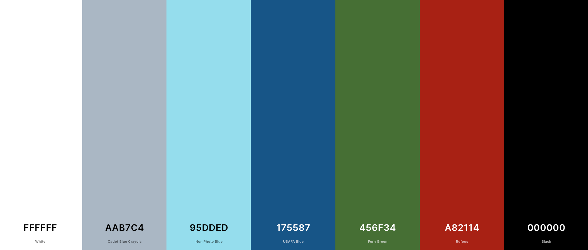

#### **Typography**

All fonts were sourced from [Google Fonts](https://fonts.google.com/). I used [Font Joy](https://fontjoy.com/) to enable me to view the font choices together to make sure that they worked well together.

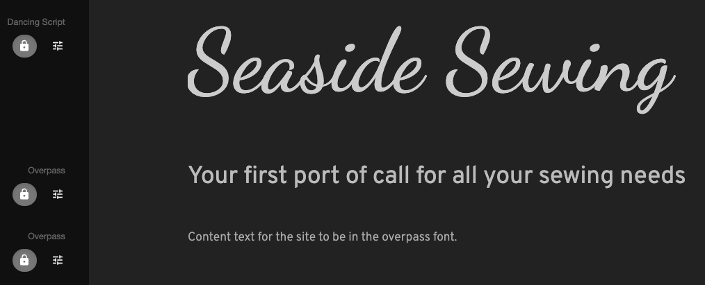

I have chosen to use Dancing Script, a handwriting font, for the site name as I feel that it gives a look of an ocean wave, with its ebb and flow. I am limiting the use of this font to the sites name as due to the font being a cursive, it is not very accessible.


I have chosen to use Overpass for all other text on the site. This font is sans-serif font, which is very accessible as a web font.

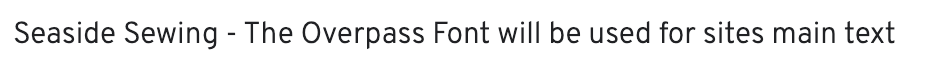

#### **Imagery**

Due to the name of the site, I have chosen to go with images of the seaside.

The hero image for the site is of a lighthouse on an island surrounded by water. The footer is an image of sea life underwater on the ocean floor. I feel these images give the site a cohesive feel - as we start at the top of the site above the water, and then we travel down until we get to the bottom of the page to the footer, which is the ocean floor. I feel it gives the site a bit of a whimsical feel, which I wanted, as a lot of e-commerce sites can be very bland and all look the same.

#### **Base Mockup**

I created the following mockup to get an idea of what the sites header and footer would look like with my chosen images, and whether the look I was going for would work. I am happy with the result.


---

## Features

### General Features of of the site

Each page of the site shares the following:

* Favicon - I used [Favicon.io](https://favicon.io/) to create the favicon for the site. As the images I tried to use to create the favicon came out very pixelated, I have used the initials of the site to create the favicon using the same font and colours from the site.

  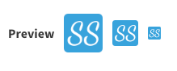

* Navbar - The navbar on the site is split into two sections, the first section contains the search bar, an account icon and the bag icon. The second section contains the sites products categories. The navbar is fully responsive, and utilises a hamburger menu toggle on smaller screens. The Categories links in the navbar move up when hovered over to give the user feedback that they are selecting that category. A dropdown menu will then show with further options. The account icon also contains a dropdown menu which displays different options depending on whether a user is logged in, and whether the user has a superuser account.

  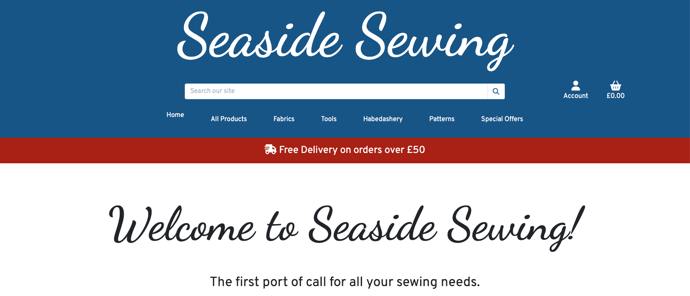

  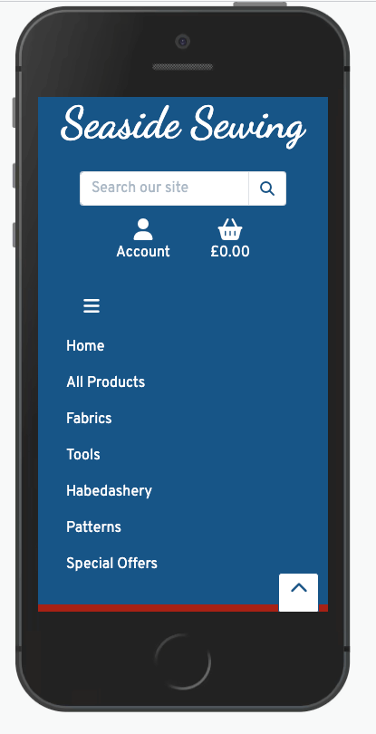

* Footer - The footer is broken into 4 distinct sections - a section that contains information about the site, such as terms and conditions and policies. The second section contains contact information for the site, such as a link to the contact form, and social media links. The third section gives the user further information on the payment processor for the site, Stripe, along with the cards accepted. The final section is a disclaimer to let users know this site was created as an educational product and to remind users that no orders will be processed. The footer is fully responsive, and on small screens stacks the sections.

  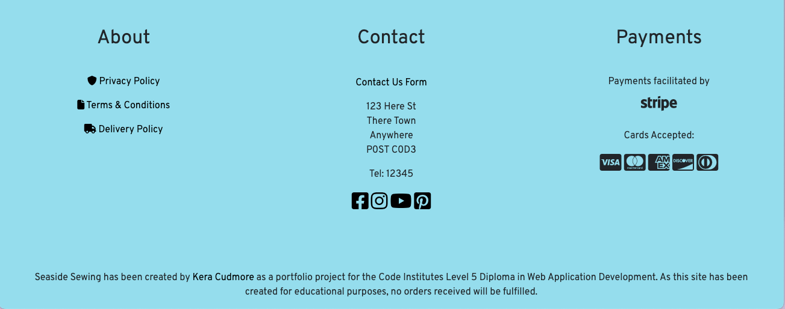

  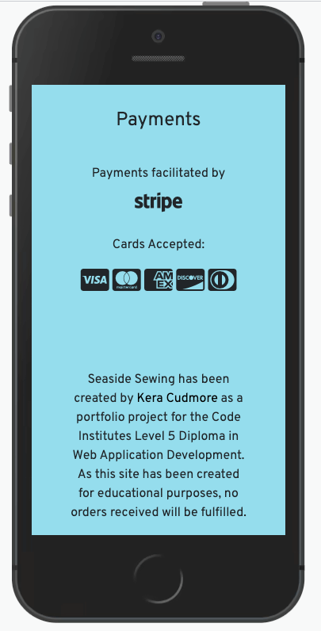

#### **Sites header and footer images**

The current implementation of the site does not feature the header and footer image as envisaged in the mockup, due to issues I faced with trying to resize SVG files. This is something I would like to add in to the next implementation of the project, however some optimisation to the current performance scores will likely be needed first to prevent them dropping any lower.

#### **Defensive programming**

Defensive programming has been used throughout the site to prevent users accessing pages when they don't have the relevent permissions. This has been accomplished by checking whether a user is a superuser for admin related tasks. If users try to access pages that they don't have the required permission level for, they will be shown an error toast which gives feedback to the user to let them know they don't have the required permissions as only an administrator can perform those tasks.

#### **Stock management system**

I have implemented a rudimentary stock management system within the site. Products have a stock value (this is set to 0 as default when a product is created) and I have used Django to inject these values onto my products and product details page in the tag section so a user is able to see how many of that item is currently in stock. I have used this stock value as the upper limit for the plus quantity buttons to prevent a user entering more of a product into their cart if there is not enough stock to meet the demand. On checkout, I update the stock values for each product to reduce them by the quantity purchased. An if/else statement checks to see if the stock value is 0, and if it is an out of stock text will display instead of a stock value. As the plus quantity button uses the stock value, this will also become disabled preventing the user adding the product to their cart. The user can manually input a quantity in the quantity input, however on clicking the add to bag button, they will be shown a tooltip letting them know that there is not enough stock to process their request.

This is a very basic way of creating a stock management system, and has its flaws, as several users could potentially have the stock in their bags at the same time. Ideally the better way to acomplish this would be to utilise a separate stock table, and to update the stock value upon adding to the bag. This would update the stock value then shown to other users of the site and prevent several people purchasing the last of stock at the same time. The stock value would then have to be changed should a user close their browser tab with items in the bag (as this would close their session cookie which is where the bag is being stored) and not complete their purchase. This was a little too complex for me to delve into during this project due to the limited timeframe I had, however it is something I would like to learn more about as this would make my e-commerce store more polished and professional grade.

#### **Feaures for next version**

Due to time constraints, I have not had chance to implement these features in this version of the shop. I have taken the time to make sure that the core functionality of the site is complete and would like to add these features in the next version. This is the same for the social media log in section.

#### **Home Page**

The home page of the site features a welcoming message and underneath displays cards with each of the categories on. These cards when clicked will take a user directly to that categories product page. currently all the cards feature a line illustration of a lighthouse, however in the next phase of the project I would like to update the categories model to include an image and be able to update each card with an image that represents that category which I think will increase users understanding of what is included in that category.

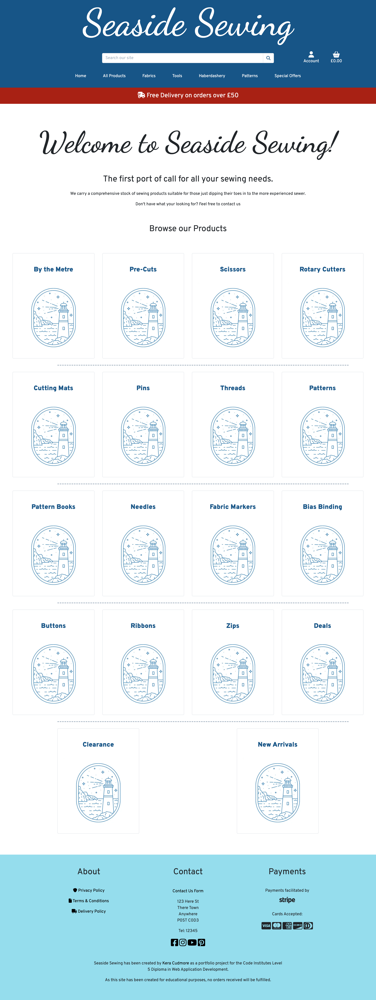

#### **Products Page**

The Products page displays the products showing an image (if one is not available a default no image filler image is inserted), the products name, its price, its tags (if the product tag has a value it will be rendered on the page) - Category, colour, star rating and stock level. If the user is a superuser there will also be an update and delete link on the right of the product information for ease of editing and deleting products.

At the top left of the products page you will be able to see the number of items on the page, and if you are viewing a category, there will be a link to allow you to easily view all products. If you have performed a search, you will also be shown the search term used here.

On the top right hand side of the page is a sort by dropdown. This enables the user to sort price and rating in ascending/descending order, and name and category in alphabetical order A-Z or Z-A.

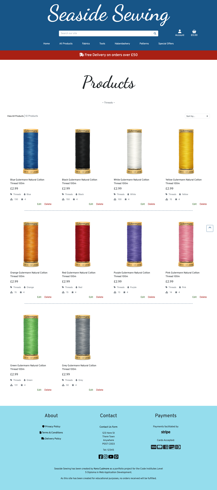

#### **Product Details Page**

The product detail page gives more details about the chosen item. An image of the product is displayed on the left of medium and large screens, and at the top of small screens. When the user hovers over the image they are shown a magnifying lens which allows them to look at the item in more detail (perfect for looking at intricate patterns of some of the fabrics!). This magnifying lens works on desktop and mobile.

To the right on medium and large screens (underneath the image on small screens) is the Product information. The title is displayed followed by the price, and if the user is a superuser, they will find a set of edit and delete buttons for the product for ease of admin. The description for the product follows and underneath that the tags (if they contain values) for category, colour, stock and rating. The Category Tag is a link that when clicked will take the user to the products page containing all items in that category.

A quantity selector comes next, with plus and minus buttons and a quantity input which allows the user to input their value. The minus quantity button is disabled when the value is 1, and is enabled above this. The plus button is enabled until it reaches the stock level, and then becomes disabled. The user may enter more than the stock level into the quantity input box, however they will be shown a tooltip on trying to add the item to their bag letting them know the value must be equal or less than the stock level as a number.

Users are shown two buttons underneath the quantity selector, one to add the product to the bag, and one to go back to the product page. If the user selects the add to bag button, they will be shown a success toast letting them know the product was added to the bag, and then they will be given a quick overview of the items in their bag together with their quantities, the total price excluding delivery, if they have not reached the free delivery threshold they will be given an amount they need to spend to get the free delivery and a button to go to the checkout.

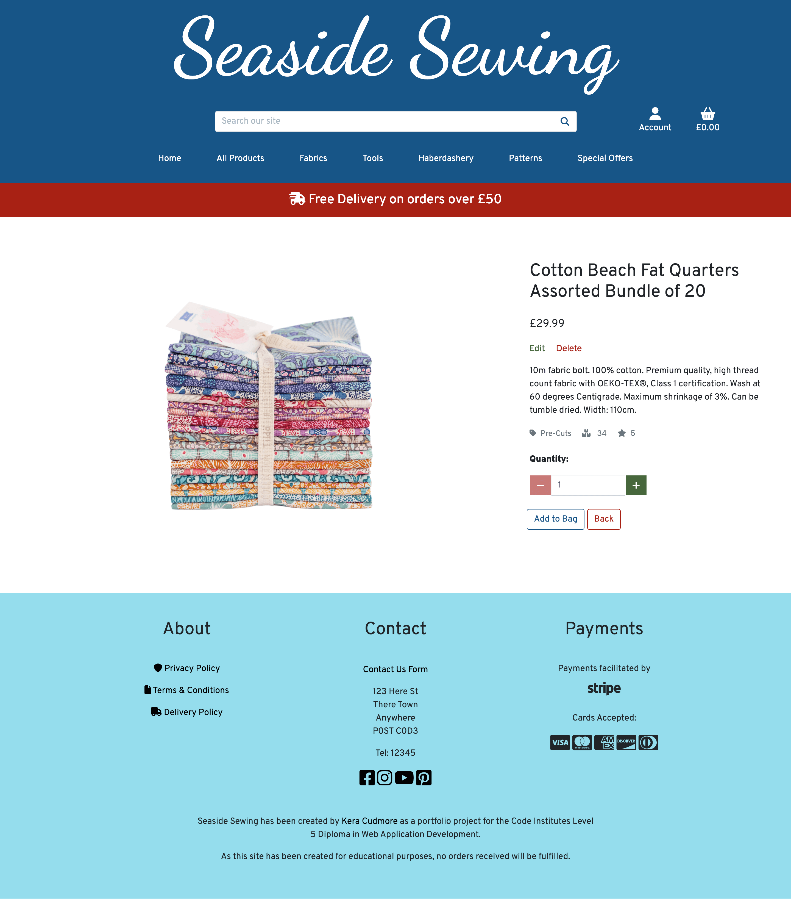

#### **Bag Page**

The bag page lists all items the user has added to their bag. It displays an image of the item, the product name  & sku, the price of the item and the quantity selected and the subtotal for that item. Users are able to adjust the quantity of the item in the bag here, as well as delete the item from their bag. Like the product detail page, the user won't be able to exceed the stock level for that item.

At the bottom the user is shown their bag total, the delivery fee and then a grand total. If the user hasn't reached the free delivery threshold, a small piece of text will highlight to the user that they only need to spend the amount shown to get free delivery. Underneath the totals are a back to shop button and a secure checkout button. The back to shop button takes the user back to the products page and the secure checkout button takes the user to the checkout.

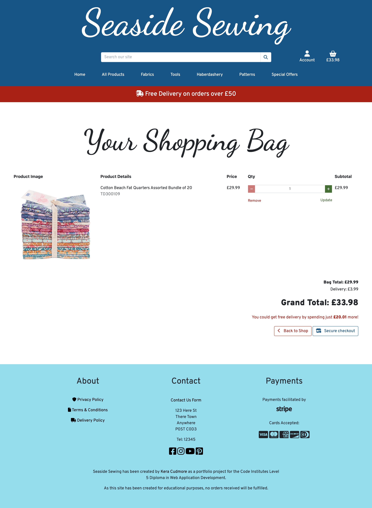

#### **Checkout Page**

The checkout page is broken into two sections, a delivery information section and an order summary section.The delivery information section provides inputs for the user to enter their name, email and phone number, a delivery section contains inputs for the address and a dropdown to select their country. If the user is logged in and has filled out their profile, information from the profile will be pre-populated in this form, for a faster checkout experience. The user is also given a checkbox at the bottom of the delivery information which allows them to save the information they have input in their profile for future use.

If a user is not signed during checkout, instead of the checkbox, they will be given the options to either create an account or login if they already have one. This is optional - as users can checkout as a guest, however this means that they will not be able to view their previous orders on the site.

The last section is the payment information section. Payments are processed by Stripe and to facilitate payment, a user needs to input their card details into the payment box. If the details are invalid a warning will be displayed under the payment box giving the user feedback on what the error was.

Beneath the payment section are an adjust bag button which takes the user back to their bag and a complete order button which processes their payment. Underneath the buttons the user is reminded that their card will be charged the grand total amount.

The order summary section contains an image, name, quantity and subtotal for each item in the bag, along with an order total, delivery fee and the grand total.

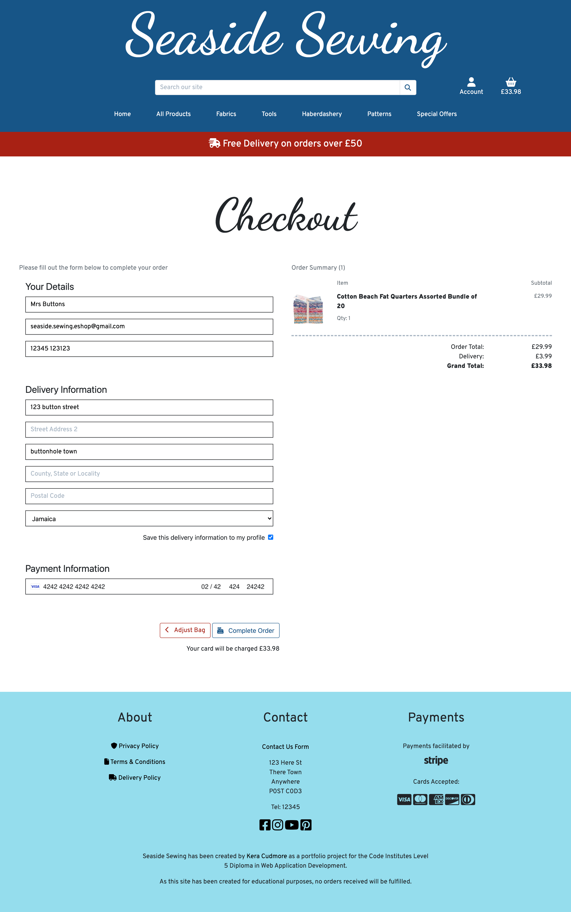

#### **Checkout Payment Overlay**

When a user clicks the complete order button, a checkout payment overlay is displayed which shows a pulsing spinner which gives the user feedback that their payment is being processed.

If there is an error with the delivery information form the user will be taken back to the checkout page and they will be shown an error toast informing them there was a problem with their information and to try again.

#### **Checkout Success Page**

If the payment is successful the user will then be shown the checkout success page. This lists a summary of their order and lets the user know that an email confirmation has also been sent to the email address shown on the page.

A button at the bottom of the page allows the user to go to the latest deals product page. Users are also show a success toast to let them know that their order has been placed successfully, giving them their order number and confirming an email will be sent to their email address.

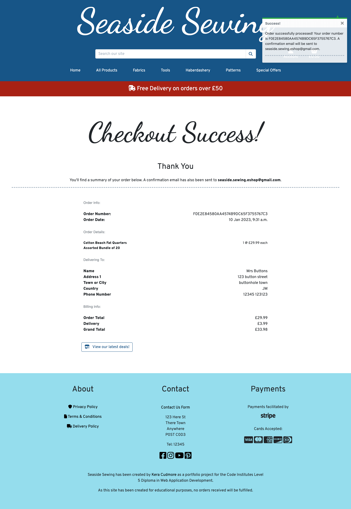

#### **Profile Page**

The profile page is broken into two sections, one for the default delivery information and the second for the order history.

The default delivery information comprises of the name, address & phone number for the user. The user can update their profile by clicking the update information button and the page will reload with the new information pre-populated in the relevant fields together with a success toast that gives the user feedback that their information has been saved successfully. This saved information will then be used in the checkout to pre-populate the payment form to speed up the checkout process for registered users.

The order history section contains all the previous orders created by the user. These list the first part of the order number, the date the order was made, the items purchased and the order total. If a user would like to look at an order in more detail they can click on the order number and they will be taken to the checkout success page that lists their order summary, together with an alert toast which informs the user they are looking at a previous order.

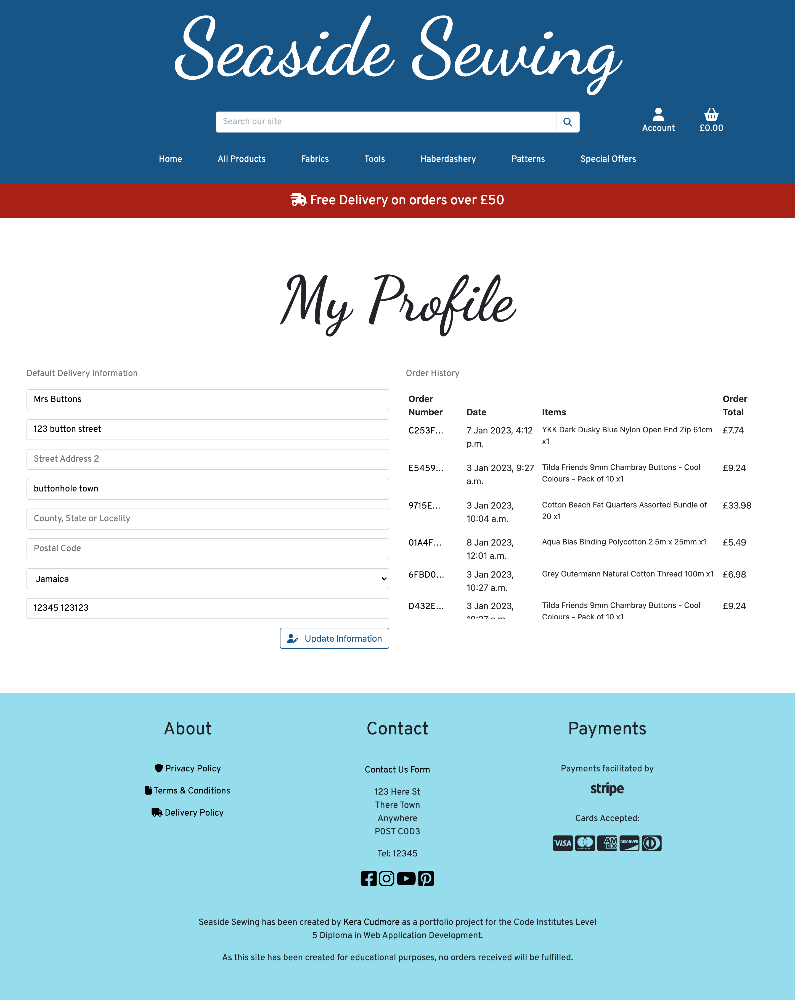

#### **Contact Page**

The contact page gives users an easy way to communicate with the shop, without leaving the site. The form has required fields of name, email and message and an optional field of phone number. Underneath the form the user is given 2 buttons, a back button and a submit form button. The back to shop button takes the user to the products page.

Once a user has submitted the form, they will be shown the contact us thank you page which thanks the user for their query, and informs them they will receive a response within 2 business days. A button is then displayed which takes the user to the latest deals products page. A toast will also let the user know their form was submitted successfully and lets them know they will hear from the shop within 2 days.

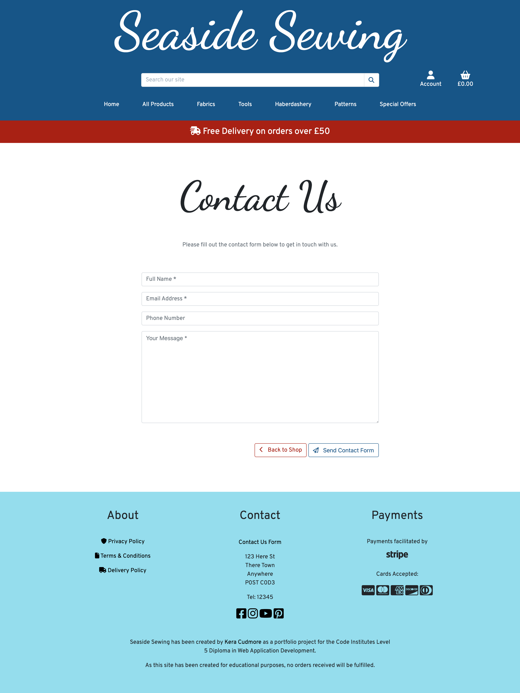

#### **404 Error Page**

The 404 error page is shown if the page a user is trying to access cannot be found (for example the user enters an incorrect product id in the product url.) Users are asked to use the navigation menu to try again. I have also made custom 400, 403 and 500 error pages which are very similar in layout to the 404 page, with a small change to reflect the error code.

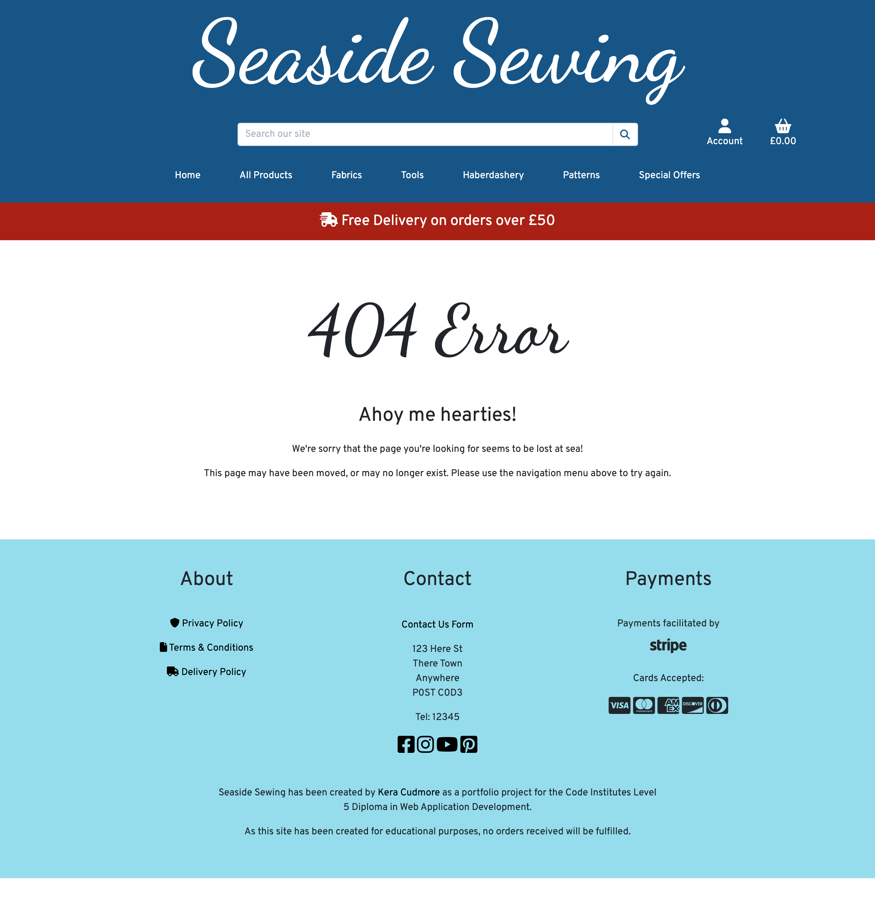

#### **Terms and Conditions Page**

The terms and conditions page lists a set of terms and conditions created on the rocket lawyer site for an e-commerce store. As this project is purely for educational purposes, no terms or conditions are legally binding as Seaside Sewing is not a real shop.

[Terms and Conditions Page Screenshot](documentation/readme/page-screenshots/terms.png)

#### **Privacy Policy Page**

The privacy policy page contains a privacy policy created for an e-commerce shop created on the rocket lawyer site. As this project is purely for educational purposes, the privacy policy is not legally binding as Seaside Sewing is not a real shop.

[Privacy Policy Screenshot](documentation/readme/page-screenshots/privacy.png)

#### **Delivery Policy Page**

The delivery policy sets out information for a delivery policy for the shop.

[Delivery Policy Page Screenshot](documentation/readme/page-screenshots/delivery.png)

#### **Admin Page for managing the site**

The admin page for Seaside Sewing is only accessible for superusers. I have updated the title information on the page along with the colour theme so that it fits with the front-end shop. The admin page is where superusers can create, edit and delete categories, create, edit and delete products. Create, update and delete orders as well as amend/delete line items in orders.

Super users are also able to view the contact forms sent to the store via the contact forms section. This lists the information sent by the user together with the date send, and provides the admin with a checkbox to let them know whether a reply has been sent.

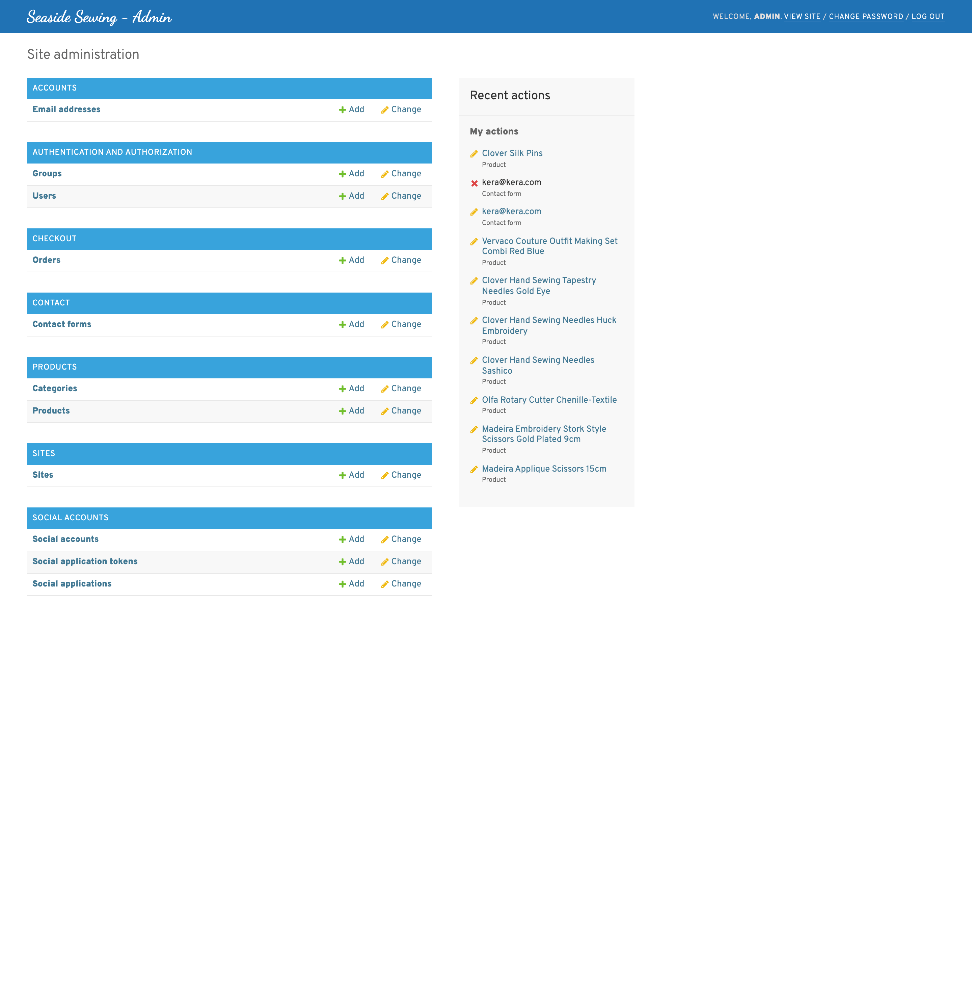

#### **Add Product Admin Only Page**

Superusers are also able to add a product directly from the site via the product management link in the account icon dropdown menu. This will provide them with a form to complete for all the various information required to create a product. If a required field is not filled in, the superuser will be shown a tooltip asking them to fill in the required fields. The superuser is shown two buttons at the bottom of the form, one to cancel, which if selected returns the superuser to the products page and an add product button. Once a superuser creates a new item and clicks the add product button they will be shown a success toast letting them know that the product was successfully created, and they will be shown that products product detail page.

If a regular user tries to view the add product page, defensive programming is in place so that they will be shown an error toast that informs them only administrators have the permissions to perform that activity.

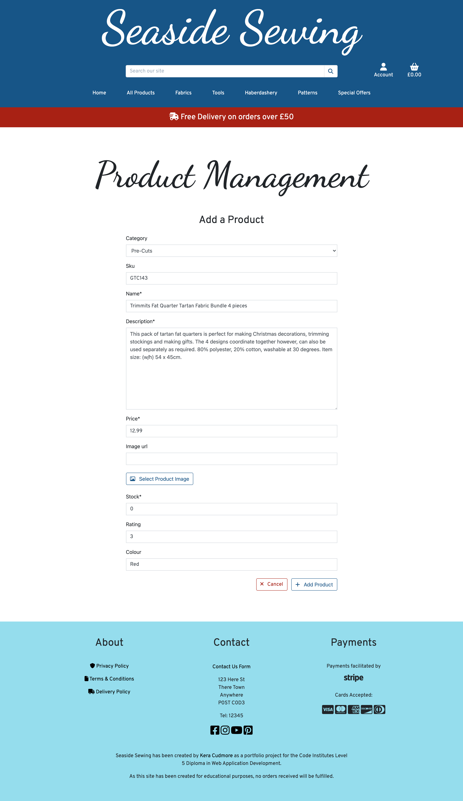

#### **Edit Product Admin Only Page**

Superusers are able to edit products directly from the site by clicking the edit button under an icon on the products page, or on the product detail page. This will open up the edit product page which will be pre-populated with the products current information. The superuser is given buttons to go back or to update the product. Upon update, they will be shown the product detail page for that product, and a success toast will show letting them know the product they updated was successful.

If a regular user tries to view the edit product page, defensive programming is in place so that they will be shown an error toast that informs them only administrators have the permissions to perform the activity.

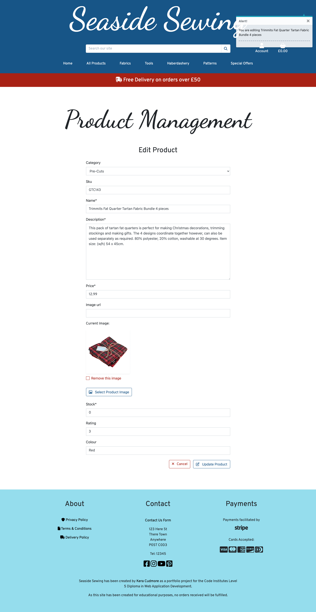

#### **Delete Product Admin Only Page View**

If a superuser clicks the delete link, either on the product page or from the product detail page they will be shown a pop up modal asking them to confirm the deletion and informing them that this action cannot be undone. This provides an extra layer of security to prevent items being deleted accidentally.

Regular users trying to manually access the url for product deletion will be shown an error toast informing them that only an administrator has the permissions to perform the task. Users that are not logged into an account will be redirected to the sign in page.

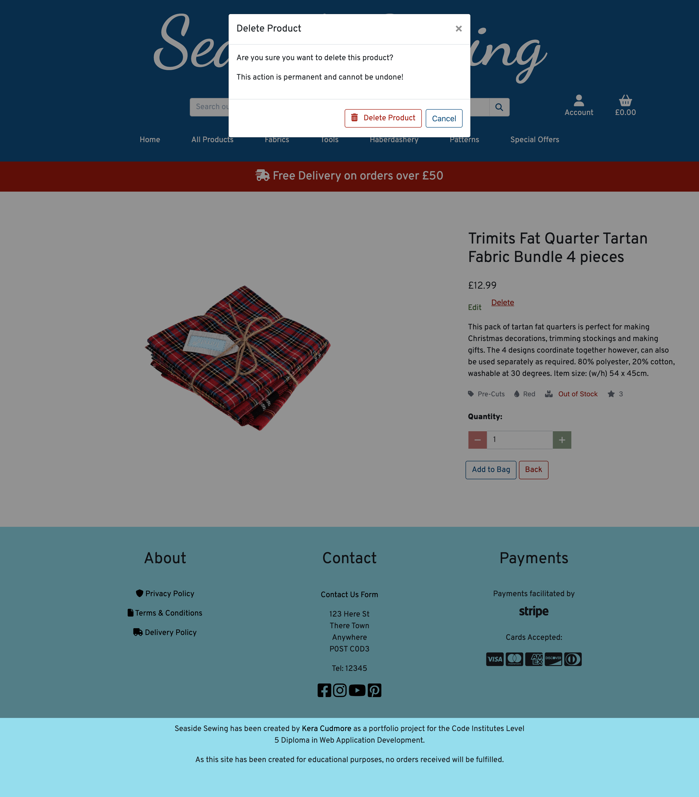

#### **Signup Page**

The signup page asks the user to enter their email address twice (to prevent any input errors) select a username for their account, and then input their password twice (again to check for input errors). The user is also given two button choices - one to return to the home page and the other is to signup for an account. Once the user clicks the signup button, they will be shown

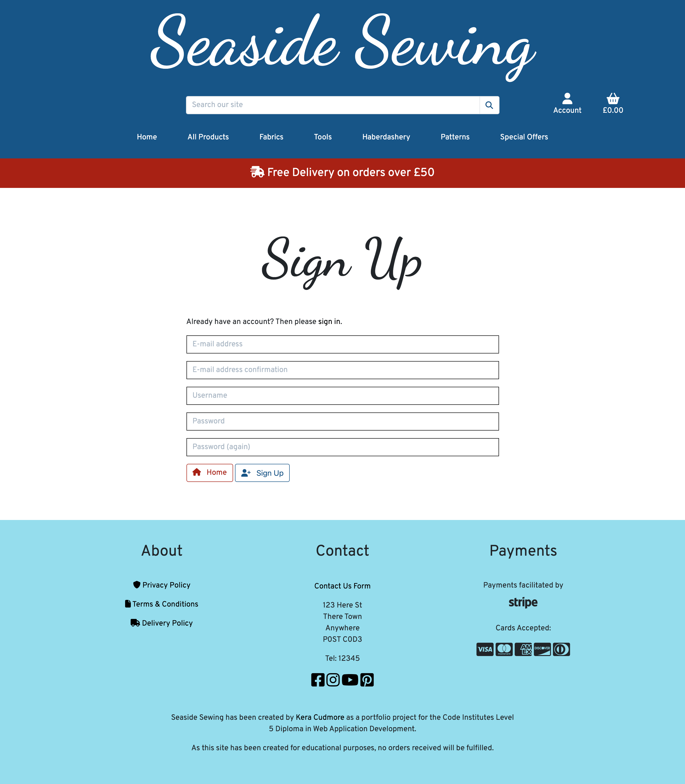

#### Sign in Page

The sign in page provides inputs for a user to enter their username/email together with their password along with three buttons, a back button, a sign in button and a forgot password button. A message at the top of the page provides a link to users if they don't currently have an account which directs them to the register page. Due to time constraints I have been unable to add the social logins to this version of the site, and would look to add this in a future version.

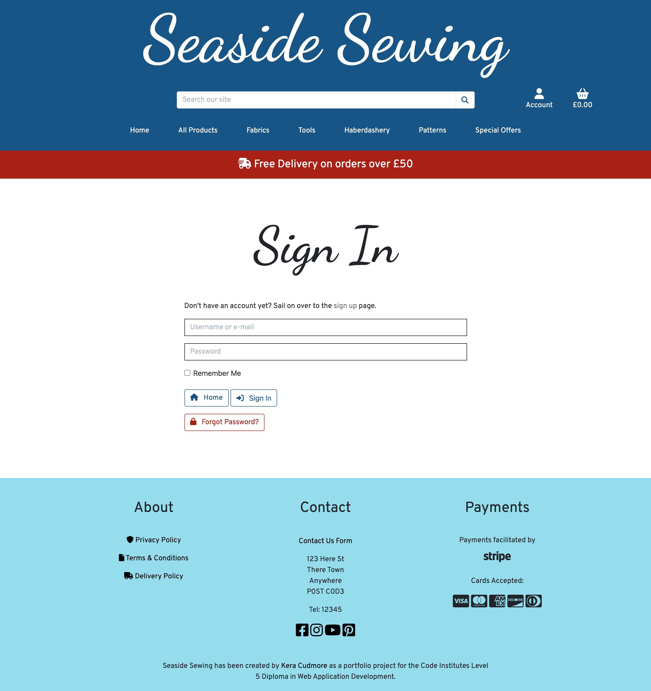

#### **Verify Email Page**

When a user registers they will be sent an [email](documentation/readme/page-screenshots/email-verify-account.png) to verify their email address. If the user clicks on the link in the email they are taken to the verify email page where they can vertify their email and complete registration. They will then be automatically redirected to the login page where a toast will let them know that they have verified their account successfully.

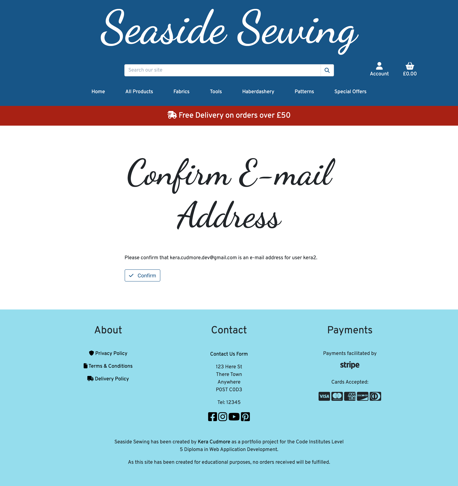

#### **Sign out page**

When a user selects the sign out link from the account dropdown, they will be asked to confirm that they wish to sign out of their account. The user can either select the cancel button which will redirect them to the home page, or they can confirm they wish to sign out by clicking the sign out button. The user will be redirected to the home page signed out of their account and shown a success toast letting them know they were successfully signed out.

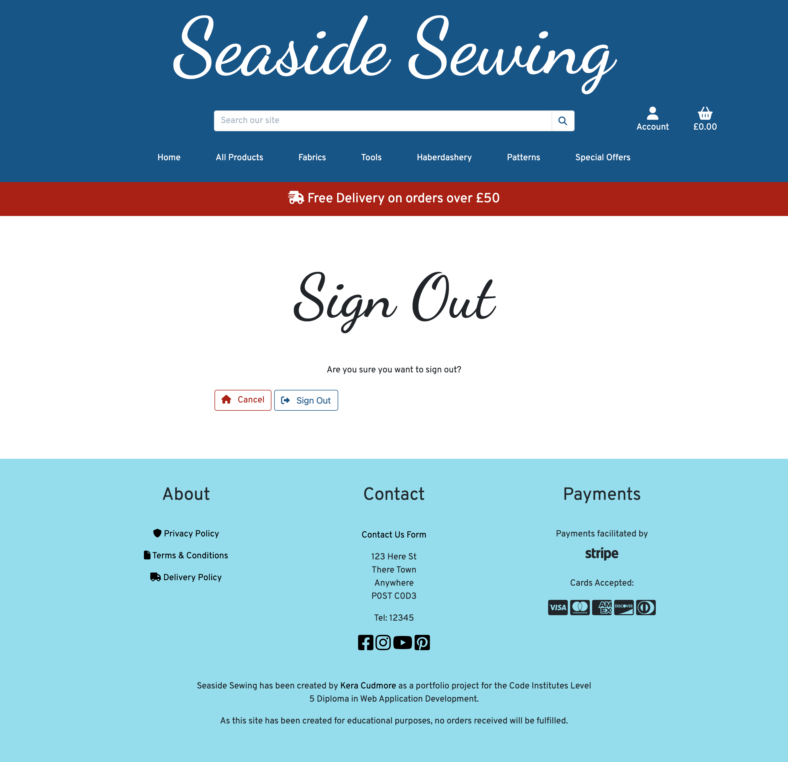

#### **Forgotten Password**

If a user has forgotten their password they will be asked to enter their email, and Seaside Sewing will send them an [email](documentation/readme/page-screenshots/password-reset-email.png) to reset the password.

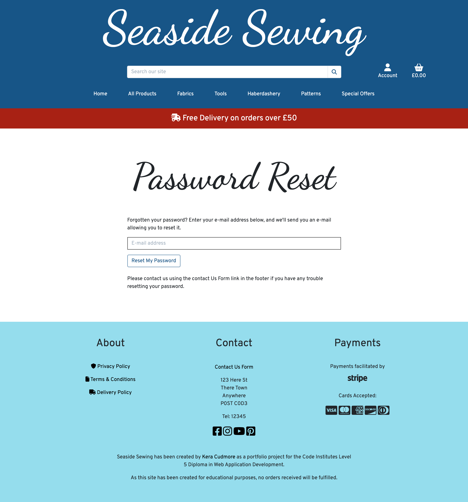

####  **Change password Page**

Once a user clicks on the link sent to their email address they will be taken to the password reset page, here they can enter their new password twice (to prevent input errors)

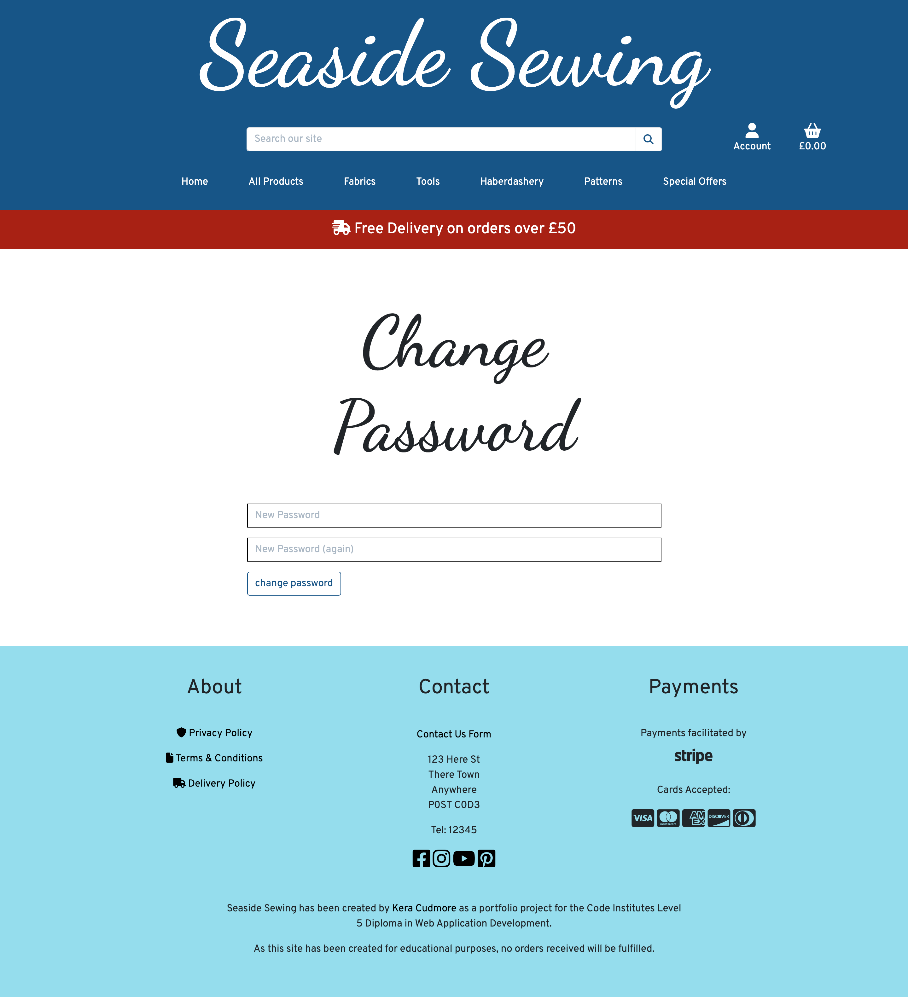

#### **Password Changed Page**

Once you have submitted your new password you will be shown a message to let you know your password has successfully been changed and will also see an alert toast to confirm your password change was successful.

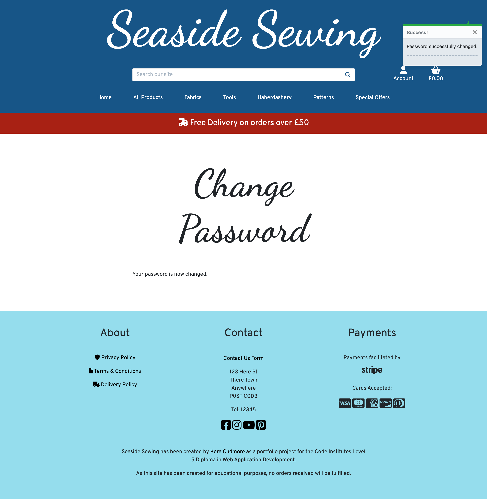

### Future Implementations

In future implementations I would like to:

* Allow coupons to be accepted in the checkout.
* Send newsletters to users.
* Implement Social login.
* Create a fully functioning stock management system that updates the stock value upon insertion to the bag and returns the value to the stock if the bag session ends. This was currently out of scope for me currently as a student and for this project, however it is something I would really like to learn more about.
* Add user reviews for products with a rating facility
* Wish list functionality for users to add and remove products from their wish list and to send products to others perhaps through a social link on the product details page
Create groups of users on the admin page, to enable sending out specific emails, such as birthday coupons or loyal customer coupons. This section could also be used to create different mailing groups for newsletters depending on users preferences.

### Accessibility

I have been mindful during coding to ensure that the website is as accessible friendly as possible. This has been have achieved by:

* Using semantic HTML.
* Using descriptive alt attributes on images on the site.
* Providing information for screen readers where there are icons used and no text.
* Ensuring that there is a sufficient colour contrast throughout the site. (update on colours chosen explained in the colour scheme section.)

Accessibility was tested using Lighthouse and WAVE and further information can be found in the [TESTING.md](TESTING.md)

---

## Technologies Used

### Languages Used

HTML, CSS, JavaScript, Python

### Database Used

sqlite3 for development.

[ElephantSQL](https://www.elephantsql.com/) for deployment.

### Frameworks Used

[Django](https://www.djangoproject.com/) - Version 3.2.16 - A high-level Python web framework that encourages rapid development and clean, pragmatic design.

[Bootstrap](https://getbootstrap.com/docs/4.6/getting-started/introduction/) - Version 4.6.2 - A framework for building responsive, mobile-first sites.

### Libraries & Packages Used

[jQuery](https://jquery.com/) - Version 3.6.2 - A JavaScript Framework

[Font Awesome](https://fontawesome.com/) - Version 6.2.1 - Used for the iconography of the site, this was added using a CDN link.

[Django Allauth](https://django-allauth.readthedocs.io/en/latest/) - Version 0.41.0 - Used for authentication, registration & account management.

[django-countries](https://pypi.org/project/django-countries/7.2.1/) - Version 7.2.1 - This is the latest stable version that is compatible with GitPod.

[django_crispy_forms](https://pypi.org/project/django-crispy-forms/) - provides a tag and filter that lets you quickly render forms

[gunicorn](https://pypi.org/project/gunicorn/) - a Python WSGI HTTP Server

[pillow](https://pypi.org/project/Pillow/) - Python imaging library

[dj_databsae_url](https://pypi.org/project/dj-database-url/) - allows us to utilise the DATABASE_URL variable

[psycopg2](https://pypi.org/project/psycopg2/) - a postgres database adapter which allow us to connect with a postgres database

[django-storages](https://pypi.org/project/django-storages/) - a storage backend library

[boto3](https://pypi.org/project/boto3/) - Allows connection to AWS S3 bucket

[coverage](documentation/testing/coverage/checkout-forms.png) - Used to see where there are areas of missing tests

[magnify.js](https://thdoan.github.io/magnify/) - Used to add the magnify lens to the product details product image

### Programs Used

[Am I Responsive](https://ui.dev/amiresponsive) - To create the responsive images of the site on a variety of device sizes.

[Balsamiq](https://balsamiq.com/) - Used to create wireframes.

[DrawSQL.app](https://drawsql.app/) - Used to create the database schema.

[Favicon.io](https://favicon.io/) - To create the favicon.

[Git](https://git-scm.com/) - For version control.

[GitHub](https://github.com/) - To save and store the files for this project.

[Google Dev Tools](https://developer.chrome.com/docs/devtools/) - To troubleshoot, test features and solve issues with responsiveness and styling.

[Pip](https://pypi.org/project/pip/) - A tool for installing Python packages.

[Shields.io](https://shields.io/) - To add badges to the projects documentation.

[Tiny PNG](https://tinypng.com/) - To compress images used in the README.

[Cloud Convert](https://cloudconvert.com/eps-to-svg) - To convert EPS files to SVG files for the vector images.

### Stripe

[Stripe](https://stripe.com/gb) has been used in the project to implement the payment system.

Stripe for the website is currently in developer mode, which allows us to be able to process test payments to check the function of the site.

| Type | Card No | Expiry | CVC | ZIP |
| :--- | :--- |:--- | :--- | :--- |
| Success| Visa | 4242 4242 4242 4242 | A date in the future | Any 3 digits | Any 5 digits |
| Require authorisation | 4000 0027 6000 3184 | A date in the future | Any 3 digits | Any 5 digits |
| Declined | 4000 0000 0000 0002 | A date in the future | Any 3 digits | Any 5 digits |

---

## Deployment & Local Development

### Deployment

The project is deployed using Heroku. To deploy the project:

#### **Create the Live Database**

We have been using the sqlite3 database in development, however this is only available for use in development so we will need to create a new external database which can be accessed by Heroku.

1. Go to the [ElephantSQL](https://www.elephantsql.com/) dashboard and click the create new instance button on the top right.
2. Name the plan (your project name is a good choice), select tiny turtle plan (this is the free plan) and choose the region that is closest to you then click the review button.
3. Check the details are all correct and then click create instance in the bottom right.
4. Go to the dashboard and select the database just created.
5. Copy the URL (you can click the clipboard icon to copy)

#### **Heroku app setup**

  1. From the [Heroku dashboard](https://dashboard.heroku.com/), click the new button in the top right corner and select create new app.
  2. Give your app a name (this must be unique), select the region that is closest to you and then click the create app button bottom left.
  3. Open the settings tab and create a new config var of `DATABASE_URL` and paste the database URL you copied from elephantSQL into the value (the value should not have quotation marks around it).

#### **Preparation for deployment in GitPod**

1. Install dj_database_url and psycopg2 (they are both needed for connecting to the external database you've just set up):

   ```bash
   pip3 install dj_database_url==0.5.0 psycopg2
   ```

2. Update your requirements.txt file with the packages just installed:

    ```bash
    pip3 freeze > requirements.txt
    ```

3. In settings.py underneath import os, add `import dj_database_url`

4. Find the section for DATABASES and comment out the code. Add the following code below the commented out database block, and use the URL copied from elephantSQL for the value:

    (NOTE! don't delete the original section, as this is a temporary step whilst we connect the external database. Make sure you don't push this value to GitHub - this value should not be saved to GitHub, it will be added to the Heroku config vars in a later step, this is temporary to allow us to migrate our models to the external database)

    ```python
    DATABASES = {
        'default': dj_database_url.parse('paste-elephantsql-db-url-here')
    }
    ```

5. In the terminal, run the show migrations command to confirm connection to the external database:

    ```bash
    python3 manage.py runserver
    ```

6. If you have connected the database correctly you will see a list of migrations that are unchecked. You can now run migrations to migrate the models to the new database:

    ```bash
    python3 manage.py migrate
    ```

7. Create a superuser for the new database. Input a username, email and password when directed.

    ```bash
    python3 manage.py createsuperuser
    ```

8. You should now be able to go to the browser tab on the left of the page in elephantsql, click the table queries button and see the user you've just created by selecting the auth_user table.
9. We can now add an if/else statement for the databases in settings.py, so we use the development database while in development (the code we commented out) - and the external database on the live site (note the change where the db URL was is now a variable we will use in Heroku):

    ```python
    if 'DATABASE_URL' in os.environ:
        DATABASES = {
          'default': dj_database_url.parse(os.environ.get('DATABASE_URL'))
        }
    else:
        DATABASES = {
            'default': {
                'ENGINE': 'django.db.backends.sqlite3',
                'NAME': os.path.join(BASE_DIR, 'db.sqlite3')
          }
        }
    ```

10. Install gunicorn which will act as our webserver and freeze this to the requirements.txt file:

    ```bash
    pip3 install gunicorn
    pip3 freeze > requirements.txt
    ```

11. Create a `Procfile` in the root directory. This tells Heroku to create a web dyno which runs gunicorn and serves our django app. Add the following to the file (making sure not to leave any blank lines underneath):

    ```Procfile
    web: gunicorn seaside_sewing.wsgi:application
    ```

12. Log into the Heroku CLI in the terminal and then run the following command to disable collectstatic. This command tells Heroku not to collect static files when we deploy:

    ```bash
    heroku config:set DISABLE_COLLECTSTATIC=1 --app heroku-app-name-here
    ```

13. We will also need to add the Heroku app and localhost (which will allow GitPod to still work) to ALLOWED_HOSTS = [] in settings.py:

    ```python
    ALLOWED_HOSTS = ['{heroku deployed site URL here}', 'localhost' ]
    ```

14. Save, add, commit and push the changes to GitHub. You can then also initialize the Heroku git remote in the terminal and push to Heroku with:

    ```bash
    heroku git:remote -a {app name here}
    git push heroku master
    ```

15. You should now be able to see the deployed site (without any static files as we haven't set these up yet).

16. To enable automatic deploys on Heroku, go to the deploy tab and click the connect to GitHub button in the deployment method section. Search for the projects repository and then click connect. Click enable automatic deploys at the bottom of the page.

#### **Generate a SECRET KEY & Updating Debug**

1. Django automatically sets a secret key when you create your project, however we shouldn't use this default key in our deployed version, as it leaves our site vulnerable. We can use a random key generator to create a new SECRET_KEY which we can then add to our Heroku config vars which will then keep the key protected.
2. [Django Secret Key Generator](https://miniwebtool.com/django-secret-key-generator/) is an example of a site we could use to create our secret key. Create a new key and copy the value.
3. In Heroku settings create a new config var with a key of `SECRET_KEY`. The value will be the secret key we just created. Click add.
4. In settings.py we can now update the `SECRET_KEY` variable, asking it to get the secret key from the environment, or use an empty string in development:

    ```python
    SECRET_KEY = os.environ.get('SECRET_KEY', ' ')
    ```

5. We can now adjust the `DEBUG` variable to only set DEBUG as true if in development:

    ```python
    DEBUG = 'DEVELOPMENT' in os.environ
    ```

6. Save, add, commit and push these changes.

#### **Set up AWS hosting for static and media files**

! NOTE: These instructions are for setting up AWS hosting as of 5/1/23 - these may change slightly in future versions of AWS.

1. Sign up or login to your [aws amazon account](https://aws.amazon.com) on the top right by using the manage my account button and then navigate to S3 to create a new bucket.
2. The bucket will be used to store our files, so it is a good idea to name this bucket the same as your project. Select the region closest to you. In the object ownership section we need to select ACLs enabled and then select bucket owner preferred. In the block public access section uncheck the block public access box. You will then need to tick the acknowledge button to make the bucket public. Click create bucket.
3. Click the bucket you've just created and then select the properties tab at the top of the page. Find the static web hosting section and choose enable static web hosting, host a static website and enter index.html and error.html for the index and error documents (these won't actually be used.)
4. Open the permissions tab and copy the ARN (amazon resource name). Navigate to the bucket policy section click edit and select policy generator. The policy type will be S3 bucket policy, we want to allow all principles by adding `*` to the input and the actions will be get object. Paste the ARN we copied from the last page into the ARN input and then click add statement. Click generate policy and copy the policy that displays in a new pop up. Paste this policy into the bucket policy editor and make the following changes: Add a `/*` at the end of the resource value. Click save.
5. Next we need to edit the the cross-origin resource sharing (CORS). Paste in the following text:

    ```json
    [
        {
            "AllowedHeaders": [
                "Authorization"
            ],
            "AllowedMethods": [
                "GET"
            ],
            "AllowedOrigins": [
                "*"
            ],
            "ExposeHeaders": []
        }
    ]
    ```

6. Now we need to edit the access control list (ACL) section. Click edit and enable list for everyone(public access) and accept the warning box.

#### **Creating AWS groups, policies and users**

1. Click the services icon on the top right of the page and navigate to IAM - manage access to AWS services. On the left hand navigation menu click user groups and then click the create group button in the top right. This will create the group that our user will be placed in.
2. Choose a name for your group - for example manage-seaside-sewing, and click the create policy button on the right. This will open a new page.
3. Click on the JSON tab and then click the link for import managed policy on the top right of the page.
4. Search for S3 and select the one called AmazonS3FullAccess, then click import.
5. We need to make a change to the resources, we need to make resources an array and then change the value for resources. Instead of a `*` which allows all access, we want to paste in our ARN. followed by a comma, and then paste the ARN in again on the next line with `/*` at the end. This allows all actions on our bucket, and all the resources in it.
6. Click the next: tags button and then the next:review .
7. Give the policy a name and description (e.g. seaside-sewing-policy | Access to S3 bucket for seaside sewing static files.) Click the create policy button.
8. Now we need to atach the policy we just created. On the left hand navigation menu click user groups, select the group and go to the permissions tab. Click the add permissions button on the right and choose attach policies from the dropdown.
9. Select the policy you just created and then click add permissions at the bottom.
10. Now we'll create a user for the group by clicking on the user link in the left hand navigation menu, clicking the add users button on the top right and giving our user a username (e.g. seaside-sewing-staticfiles-user). Select programmatic access and then click the next: permissions button.
11. Add the user to the group you just created and then click next:tags button, next:review button and then create user button.
12. You will now need to download the CSV file as this contains the user access key and secret access key that we need to insert into the Heroku config vars. Make sure you download the CSV now as you won't be able to access it again.

#### **Connecting Django to our S3 bucket**

1. Install boto3 and django storages and freeze them to the requirements.txt file.

    ```bash
    pip3 install boto3
    pip3 install django-storages
    pip3 freeze > requirements.txt
    ```

2. Add `storages` to the installed apps in settings.py
3. Add the following code in settings.py to use our bucket if we are using the deployed site:

    ```python
    if 'USE_AWS' in os.environ:
        AWS_S3_OBJECT_PARAMETERS = {
            'Expires': 'Thu, 31 Dec 2099 20:00:00 GMT',
            'CacheControl': 'max-age=9460800',
        }
        
        AWS_STORAGE_BUCKET_NAME = 'enter your bucket name here'
        AWS_S3_REGION_NAME = 'enter the region you selected here'
        AWS_ACCESS_KEY_ID = os.environ.get('AWS_ACCESS_KEY_ID')
        AWS_SECRET_ACCESS_KEY = os.environ.get('AWS_SECRET_ACCESS_KEY')
        AWS_S3_CUSTOM_DOMAIN = f'{AWS_STORAGE_BUCKET_NAME}.s3.amazonaws.com'
    ```

4. In Heroku we can now add these keys to our config vars:

    | KEY | VALUE |
    | :--- | :--- |
    | AWS_ACCESS_KEY_ID | The access key value from the amazon csv file downloaded in the last section |
    | AWS_SECRET_ACCESS_KEY | The secret access key from the amazon csv file downloaded in the last section |
    | USE_AWS | True |

5. Remove the DISABLE_COLLECTSTATIC variable.
6. Create a file called custom_storages.py in the root and import settings and S3Botot3Storage. Create a custom class for static files and one for media files. These will tell the app the location to store static and media files.
7. Add the following to settings.py to let the app know where to store static and media files, and to override the static and media URLs in production.

    ```python
    STATICFILES_STORAGE = 'custom_storages.StaticStorage'
    STATICFILES_LOCATION = 'static'
    DEFAULT_FILE_STORAGE = 'custom_storages.MediaStorage'
    MEDIAFILES_LOCATION = 'media'
    
    STATIC_URL = f'https://{AWS_S3_CUSTOM_DOMAIN}/{STATICFILES_LOCATION}/'
    MEDIA_URL = f'https://{AWS_S3_CUSTOM_DOMAIN}/{MEDIAFILES_LOCATION}/'
    ```

8. Save, add, commit and push these changes to make a deployment to Heroku. In the build log you should be able to see that the static files were collected, and if we check our S3 bucket we can see the static folder which has all the static files in it.
9. Navigate to S3 and open your bucket. We now want to create a new file to hold all the media files for our site. We can do this by clicking the create folder button on the top right and naming the folder media.

#### **Setting up Stripe**

1. We now need to add our Stripe keys to our config vars in Heroku to keep these out of our code and keep them private. Log into Stripe, click developers and then API keys.
2. Create 2 new variables in Heroku's config vars - for the publishable key (STRIPE_PUBLIC_KEY) and the secret key (STRIPE_SECRET_KEY) and paste the values in from the Stripe page.
3. Now we need to add the WebHook endpoint for the deployed site. Navigate to the WebHooks link in the left hand menu and click add endpoint button.
4. Add the URL for our deployed sites WebHook, give it a description and then click the add events button and select all events. Click Create endpoint.
5. Now we can add the WebHook signing secret to our Heroku config variables as STRIPE_WH_SECRET.
6. In settings.py:

    ```python
    STRIPE_PUBLIC_KEY = os.getenv('STRIPE_PUBLIC_KEY', '')
    STRIPE_SECRET_KEY = os.getenv('STRIPE_SECRET_KEY', '')
    STRIPE_WH_SECRET = os.getenv('STRIPE_WH_SECRET', '')
    ```

### Local Development

#### **How to Fork**

To fork the repository:

1. Log in (or sign up) to GitHub.

2. Go to the repository for this project, [seaside-sewing](https://github.com/kera-cudmore/seaside-sewing).

3. Click on the fork button in the top right of the page.

#### **How to Clone**

To clone the repository:

1. Log in (or sign up) to GitHub.

2. Go to the repository for this project, [seaside-sewing](https://github.com/kera-cudmore/seaside-sewing).

3. Click the Code button, select whether you would like to clone with HTTPS, SSH or the GitHub CLI and copy the link given.

4. Open the terminal in your chosen IDE and change the current working directory to the location you would like to use for the cloned repository.

5. Type the following command into the terminal `git clone` followed by the link you copied in step 3.

6. Set up a virtual environment (this step is not required if you are using the Code Institute template and have opened the repository in GitPod as this will have been set up for you).

7. Install the packages from the requirements.txt file by running the following command in the terminal:

```bash
pip3 install -r requirements.txt
```

---

## Testing

Please refer to the [TESTING.md](TESTING.md) file for all testing performed.

---

## Credits

### Code Used

This project was created using methods taught in the Code Institutes walkthrough project for Boutique Ado.

The code to create the image zoom on the products page was taken from [Thdoan Magnify JS](https://thdoan.github.io/magnify/)

### Content

Content for the site was written by Kera Cudmore, save for product descriptions, which were adapted from the product descriptions on the Groves website.

### Media

* [Lighthouse Header Image](https://www.vecteezy.com/vector-art/8273454-lighthouse-in-on-the-island-in-the-middle-of-the-sea) - Designed by Graphics RF, sourced from Vecteezy
* [Underwater Footer Image](https://www.vecteezy.com/vector-art/9102436-silhouette-of-coral-reef-with-fish-and-divers-on-blue-sea-background-underwater-vector-illustration) - Designed by duangdee123050146, sourced from Vecteezy

* [Groves & Banks Ltd](https://www.grovesltd.co.uk/) - For allowing me permission to use any of the images of their products from their website.

* [Noimage](https://www.canva.com/search/templates?q=lighthouse) - Created for free on Canva, utilising their design elements (Elegant minimalistic logo with lighthouse for seafood cafe) in the colour theme of my site.

### Acknowledgments

I would like to acknowledge the following people who have helped me with completing this project:

* My family for their patience and support whilst working on my final project.
* My Code Institute mentor [Adegbenga Adeye](https://github.com/deye9).
* Nerd Alert for their constant support and encouragement while completing this project.
* The Code Institute Tutors who assisted me with troubleshooting when I was stuck on a particularly difficult bug.
