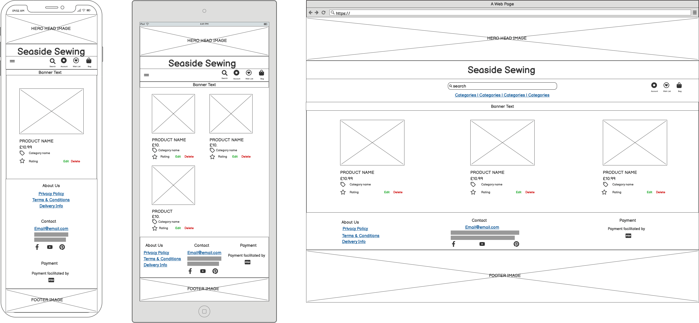
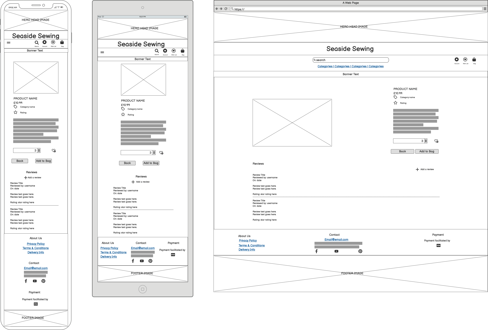

# Seaside Sewing


Seaside Sewing is a full stack e-commerce website built using Django, Python, HTML, CSS and JavaScript. The website utilises Stripe as the payment processor.

This project was created as my fourth milestone project for my Level 5 Diploma in Web Application Development with the Code Insitute.

[Visit Seaside Sewing Here](https://dashboard.heroku.com/apps/seaside-sewing)

   

---

## Contents

* [User Experience](#user-experience)
  * [Strategy Plane](#strategy-plane)
    * [Project Goals](#project-goals)
  * [Scope Plane](#scope-plane)
    * [Feature Planning](#feature-planning)
  * [Structure Plane](#structure-plane)
    * [User Stories](#user-stories)
    * [Database Schema](#database-schema)
    * [User Journey](#user-journey)
  * [Skeleton Plane](#skeleton-plane)
    * [Wireframes](#wireframes)
  * [Surface Plane](#surface-plane)
    * [Colour Scheme](#colour-scheme)
    * [Typography](#typography)
    * [Imagery](#imagery)
    * [Base Mockup](#base-mockup)
* [Features](#features)
  * [General Features of The Site](#general-features-of-of-the-site)
  * [Future Implementations](#future-implementations)
  * [Accessibility](#accessibility)
* [Technologies Used](#technologies-used)
  * [Languages Used](#languages-used)
  * [Database Used](#database-used)
  * [Frameworks Used](#frameworks-used)
  * [Libraries & Packages Used](#libraries--packages-used)
  * [Programs Used](#programs-used)
  * [Stripe](#stripe)
* [Deployment & Local Development](#deployment--local-development)
  * [Deployment](#deployment)
  * [Local Development](#local-development)
    * [How to Fork](#how-to-fork)
    * [How to Clone](#how-to-clone)
* [Testing](#testing)
* [Credits](#credits)
  * [Code Used](#code-used)
  * [Content](#content)
  * [Media](#media)
  * [Acknowledgments](#acknowledgments)

---

responsive site image here

---

## User Experience

### Strategy Plane

#### **Project Goals**

Seaside Sewing is a Business to Consumer (B2C) ecommerce site.

The sites primary audience will be people who have a love of sewing and quilting. It will cater to a range of sewists from beginners through to experts, by selling a range of items over different price points. Seaside Sewing aims to allow customers to purchase all their requirements for their projects on one website.

### Scope Plane

#### **Feature Planning**

Below is a table of opportunities for the project, together with a score of their importance level and viability (rated low to high, 1-5). Products that score highly on importance and viability will be features that must be addressed first as part of the MVP. Features that are scored mid range are should have features, which will be added to the project once it has achieved MVP status. Low scored features, are could have features and if not attended to in this development version will be marked to be addressed in a future version.

| Feature | Importance | Viability |  |
| :--- | :---: | :---: | :---: |
| User roles | 5 | 5 | MVP |
| Sign up for an account | 4 | 5 | MVP |
| Account Profile | 4 | 5 | MVP |
| Password recovery | 5 | 5 | MVP |
| Use social media to sign up/log in | 2 | 4 | |
| Seach and filter through products | 5 | 5 | MVP |
| Checkout system | 5 | 5 | MVP |
| Guest Checkout | 3 | 4 | |
| Payment Via Stripe | 5 | 5 | MVP |
| Receive email confirmation for order | 5 | 5 | MVP |
| Order History | 4 | 5 | |
| Admin - add product | 5 | 5 | MVP |
| Admin - edit/update product | 5 | 5 | MVP |
| Admin - delete product | 5 | 5 | MVP |
| Admin - Stock managment | 2 | 3 | |
| Admin - Sales Reporting | 1 | 2 | |
| Terms and Conditions | 3 | 5 | |
| Privacy Policy | 3 | 5 | |
| Delivery Terms | 3 | 5 | |
| Social Media Links | 3 | 5 | |
| Contact form | 3 | 3 | |
| Newsletter | 2 | 3 | |
| Wishlist | 3 | 3 | |
| Product Reviews | 4 | 4 | |
| Blog | 1 | 3 |  |
| Discount Vouchers | 1 | 1 | |

### Structure Plane

#### **User Stories**

| User Story ID | As a/an | I want to be able to ... | So that I can... |
| :--- | :--- | :--- | :---|
| **VIEWING & NAVIGATION** |
| 1 | Shopper | Easily navigate the site | Find products/information that I am require |
| 2 | Shopper | View a category of products/filter products | Find specific items I am interested in without having to scroll through all products |
| 3 | Shopper | View more detail on products | to make an informed decision of if the item suits my requirements |
| 4 | Shopper | View items on clearance/sale easily | Save money  |
| 5 | Shopper | View my running total of purchases throughout my visit | Make sure I don't overspend & am able to track whether I meet any thresholds for site offers (e.g. free delivery) |
| 6 | Shopper | View the items I currently have selected for purchase | to enable me to check I still wish to purchase the items, or amend quantites if required |
| 7 | Shopper | View reviews for products | make informed decisions about purchasing products |
| **REGISTRATION & USER ACCOUNTS** |
| 8 | Shopper | Register for an account | Have an account with the site and view my profile |
| 9 | Shopper | Receive an email to confirm my registration | Verify my account was created successfully |
| 10 | Shopper | Log in and out | Keep my account information secure |
| 11 | Shopper | View a profile page | Set a default delivery address and view previous purchases |
| 12 | Shopper | Reset my password | Recover my account |
| 13 | Shopper | Review products | Leave a rating/review on products |
| **SORTING & SEARCHING** |
| 14 | Shopper | Sort the list of available products | Easily identify the best rated, best priced and categorically sort products |
| 15 | Shopper | Sort a specific category of products | Find the best-priced or best-rated product in a specific category, or sort the products in that category by name |
| 16 | Shopper | Sort multiple categories of products simutaneously | Find the best-priced or best-rated products across broad categories, such as fabric or habedashery |
| 17 | Shopper | Search for a product by name or description | Find a specific product I'd like to purchase |
| 18 | Shopper | Easily see what I've searched for and the number of results | Quickly decide whether the product I want is available |
| **PURCHASING & CHECKOUT** |
| 19 | Shopper | Easily select the size and quantity of a product when purchasing it | Ensure I don't accidentally select the wrong product, quantity or size |
| 20 | Shopper | View items in my bag to be purchased | Identify the total cost of my purchase and all items I will receive |
| 21 | Shopper | Adjust the quantity of individual items in my bag | Easily make changes to my purchase before checkout |
| 22 | Shopper | Easily eneter my payment information | Check out quickly and with no hassles |
| 23 | Shopper | Feel my personal and payment information is safe and secure | Confidently provide the needed information to make a purchase |
| 24 | Shopper | View an order confirmation after checkout | Verify that I haven't made any mistakes |
| 25 | Shopper | Receive an email confirmation after checking out | Keep the confirmation of what I've purchased for my records |
| **ADMIN & STORE MANAGEMENT** |
| 26 | Store Owner | Add a product | Add new items to my store |
| 27 | Store Owner | Edit/update a product | Change product prices, descriptions, images and other product criteria |
| 28 | Store Owner | Delete a product | Remove items that are no longer for sale |

#### **Database Schema**

Due to the data being used for the project I have opted to use a relational database as this will best suit my requirements.


After my initial meeting with my mentor, it was advised that I adjust the database schema slightly to normalise it. This basically means not having data in two places - as the data can be called from the first table. I therefore adjusted my user table to include the users full name, phone number and address details and removed this from the user profile. I have done the same with the users information that was duplicated in the order table, as the information can be called from the user table when required. upon reflection, I didn't see the need for sizes for the products and so have removed this column from the products table.


#### **User Journey**

flow of site

### Skeleton Plane

#### **Wireframes**

Wireframes for the project were created using [Balsamiq](https://balsamiq.com/)

* Base Template - This template contains the header and footer which are used throughout the website. This template is used as a base and then other pages content will be injected into main section using django template language.

  

* Home Page

  

* Register Page - The register page will allow users to register for an account with Seaside Sewing in one of two ways - registering for an account with a username/email or via a social account.

  The username/email path will require users to choose a username, a password which will be entered twice to confirm the user hasn't made an error when entering the password and their email address, which again will be required to be entered twice to confirm there are no mistakes in the users input.

  The social media account path will allow users to sign up for an account on Seaside Sewing by using a social media account.

  

* Login Page - The login page will allow users to sign into their account with either their username, or using their linked social account.

  

* Logout Page - The logout page will ask the user to confirm they wish to logout. If the user clicks the logout button they will be logged out of their account and redirected to the home page.

  

* Profile Page - The profile page displays a users default delivery information, and if they have previously made any orders using their account, their past purchases will also be displayed. The user can click on the order No for their previous orders and they will be taken to a detailed view of that previous order.

  

* Bag Page (Empty Bag) - The bag page will display the following message to usesrs if there are no products in their bag.

  

* Bag Page - When a user has items in their bag, they will be shown an image of the item, the title

  

* Wishlist (empty wishlist) - The wishlist page will display a message to the user to let them know there are no products currently in their wishlist and will give instructions on how to add a product to their wishlist. There will also be a button that redirects the user to the products page.

  

* Wishlist Page - The wishlist page is very similar in layout to the bag page. It displays an image of the item, the title,selected size and sku for the product along with the product price. There is also has a button to remove the product from their wishlist. The user can add an item from their wishlist to their bag by clicking on the product which will take them to the product details page where they can select sizes and quantity.

  

* Checkout Page - The checkout page requires the user to fill in their details, along with a delivery address. They are given the option via a checkbox to save the information they input to their profile. If the user has already filled in their information in their profile, the form will be prepopulated with this information.

  Underneath the users delivery information will be the payment input where the user will be required to enter their card information. If there are any errors with this input, an error message will be displayed under the input. Beneath this are the complete order buttons (which has a small message underneath it to let the user know the amount being charged to their card) and a button which redirects users back to their bag to amend their order.

  The user will also be shown a summary of the products they are purchasing. This consists of an image of the product, the title of the product, a size if applicable, the quantity they are purchasing and the subtotal for that product. Underneath the summary are the subtotal, delivery costs and grand total.

  

* Payment Processing Overlay - once the user has submitted correct payment details and clicks on the button to complete their order a payment processing overlay with an animated spinner will be displayed over the checkout page while payment is processed. Once this has processed, the user will be shown the checkout success page.

  

* Checkout Success -

  

* Products - The products page will display an image for each item along with the title for item, price, category and rating underneath. Screen size will determine how many products are displayed in a row.

  

* Products (Admin View) - The Admin view of the products page is identical to that for a user, except for the addition of an edit and delete button below each item. This will allow the admin to be able to edit or delete products easily from the products view page.

  

* Product Detail - The product detail page features an image of the product, along with the title, price, category and rating for the product.

  There is also a text description of the product which gives further information to the user to enable them to decide if the product meets their needs.

  Underneath the description is a quantity box for the user to select how many of the product they would like to purchase, along with an add to wishlist button.

  The Add to bag button and back to products buttons are placed below.

  

* Product Detail (Admin View) - The admin view of the product detail page is idential to the product detail page, except for the addition of the edit and delete buttons to allow the admin to edit and delete a product directly from their details page.

  

* Edit Product - The Edit product page is only available to admin users. It displays a form with the products details prepopulated ready for the admin to edit. The admin may also delete the current image or choose a new image to upload and display.

  

* Delete Product - The Delete product page is only available to admin users. Its displays the product image, title, category and SKU along with a message asking the admin if they are sure they want to delete the product. It also warns them that this action cannot be undone. They are given a cancel button and a delete button.

  

* 404 Error - The 404 page lets the user know there has been a problem and displays a button to redirect them to the products.

  

* Privacy Policy - The privacy policy page contains the privacy policy for the site.

  

* Terms & Conditions - The terms & conditions page contains the terms and conditions for the site.

  

* Delivery Information - The delivery page contains further information for the user on delivery options.

  

* Add review - If a user wants to add a review for a product, they will be redirected to the add review page. This will display the name of the product along with an image they would like to review. They are then given an input field to create a title for their review and a text area for the actual review. Underneath this will be a rating for the product along with a cancel and submit review button.

  

* Edit review - should I allow editing of reviews ?

* Toasts - Toasts are used to display messages to the user depending on their actions on the site. They can let users know if an action has been successful, if there has been an error or for displaying a general message. This is also reflected in the colour at the top of the toast. Toasts will also be used to display to a user what they currently have in their bag when they add a new product. Toasts can be dismissed by clicking the X on the toast.

  

### Surface Plane

#### **Colour Scheme**

I have based the colour theme for the site around the main image used at the top of the site, a lighthouse on an island surrounded by water. The shades of blue fit nicely with a seaside theme, the red gives and green nice contrast to the blue, and will be perfect to use as part of the toasts.

Text throughout the site will be either black or white, depending on the background colour.


UPDATE

Once I began working on the site, I realised that there wasn't enough of a contrast for the green text on a white background when runnning the site through the WAVE chrome extension. I have therefore used a slightly darker green to allow for a better contrast. There was a similar issue with the dark blue chosen for the site, the contrast was not passing for the sites header with white text, and so I have chosen a darker blue which does pass contrast tests with white text. I have also updated the grey colour used, as this was a colour used for other elements in bootstrap, so by changing to this allows a better cohesion in the site.

As I did not appear to be using the medium blue anywhere in the site, I have removed this.


#### **Typography**

All fonts were sourced from [Google Fonts](https://fonts.google.com/). I used [Font Joy](https://fontjoy.com/) to enable me to view the font choices together to make sure that they worked well together.


I have chosen to use Dancing Script, a handwriting font, for the site name as I feel that it gives a look of an ocean wave, with its ebb and flow. I am limiting the use of this font to the sites name as due to the font being a cursive, it is not very accessible.


I have chosen to use Overpass for all other text on the site. This font is sans-serif font, which is very accessible as a web font.


#### **Imagery**

Due to the name of the site, I have chosen to go with images of the seaside.

The hero image for the site is of a lighthouse on an island surrounded by water. The footer is an image of sealife underwater on the ocean floor. I feel these images give the site a cohesive feel - as we start at the top of the site above the water, and then we travel down until we get to the bottom of the page to the footer, which is the ocean floor. I feel it gives the site a bit of a whimsical feel, which I wanted, as a lot of e-commerce sites can be very bland and all look the same.

#### **Base Mockup**

I created the following mockup to get an idea of what the sites header and footer would look like with my chosen images, and whether the look I was going for would work. I am happy with the result.


---

## Features

### General Features of of the site

Each page of the site shares the following:

* Favicon

  I used [Favicon.io](https://favicon.io/) to create the favicon for the site. As the images I tried to use to create the favicon came out very pixalated, I have used the initials of the site to create the favicon using the same font and colours from the site.

  

* Navbar
* Footer

site pages images

### Future Implementations

In future implementations I would like to:

* Allow coupons to be accepted in the checkout.
* Send newsletters to users.
* Implement Social login.
* Create a fully functioning stock management system.
* Add user reviews
* Wishlist functionality

### Accessibility

I have been mindful during coding to ensure that the website is as accessible friendly as possible. This has been have achieved by:

* Using semantic HTML.
* Using descriptive alt attributes on images on the site.
* Providing information for screen readers where there are icons used and no text.
* Ensuring that there is a sufficient colour contrast throughout the site. (see update in the colour theme section.)

---

## Technologies Used

### Languages Used

HTML, CSS, JavaScript, Python

### Database Used

sqlite3 for development.

[ElephantSQL](https://www.elephantsql.com/) for deployment.

### Frameworks Used

[Django](https://www.djangoproject.com/) - Version 3.2.16 - A high-level Python web framework that encourages rapid development and clean, pragmatic design.

[Bootstrap](https://getbootstrap.com/docs/4.6/getting-started/introduction/) - Version 5.2.3 - A framework for building responsive, mobile-first sites.

### Libraries & Packages Used

[Django Allauth](https://django-allauth.readthedocs.io/en/latest/) - Version 0.41.0 - Used for authentication, registration & account management.

[jQuery](https://jquery.com/) - Version 3.6.2 - A JavaScript Framework

[Font Awesome](https://fontawesome.com/) - Version 6.2.1 - Used for the iconography of the site, this was added using a CDN link.

[django-countries](https://pypi.org/project/django-countries/7.2.1/) - Version 7.2.1 - This is the latest stable version that is compatible with GitPod.

### Programs Used

[Am I Responsive](https://ui.dev/amiresponsive) - To create the responsive images of the site on a variety of device sizes.

[Balsamiq](https://balsamiq.com/) - Used to create wireframes.

[DrawSQL.app](https://drawsql.app/) - Used to create the database schema.

[Favicon.io](https://favicon.io/) - To create the favicon.

[Git](https://git-scm.com/) - For version control.

[GitHub](https://github.com/) - To save and store the files for this project.

[Google Dev Tools](https://developer.chrome.com/docs/devtools/) - To troubleshoot, test features and solve issues with responsiveness and styling.

[Pip](https://pypi.org/project/pip/) - A tool for installing Python packages.

[Shields.io](https://shields.io/) - To add badges to the projects documentation.

[Tiny PNG](https://tinypng.com/) - To compress images used in the README.

[Cloud Convert](https://cloudconvert.com/eps-to-svg) - To convert EPS files to SVG files for the vector images.

### Stripe

[Stripe](https://stripe.com/gb) has been used in the project to implement the payment system.

---

## Deployment & Local Development

### Deployment

The project is deployed using Heroku. To deploy the project using Heroku:

#### Create the Live Database

We have been using the sqlite3 database in development, however this is only availble for use in development so we will need to create a new external database which can be accessed by Heroku.

1. Go to the [ElephantSQL](https://www.elephantsql.com/) dashboard and click the create new instance button on the top right.
2. Name the plan (your project name is a good choice), select tiny turle plan (this is the free plan) and choose the region that is closest to you then click the review button.
3. Check the details are all correct and then click create instance in the bottom right.
4. Go to the dashboard and select the database just created.
5. Copy the URL (you can click the clipboard icon to copy)

#### Heroku app setup

  1. From the [Heroku dashboard](https://dashboard.heroku.com/), click the new button in the top right corner and select create new app.
  2. Give your app a name (this must be unique), select the region that is closest to you and then click the create app button bottom left.
  3. Open the settings tab and create a new config var of `DATABASE_URL` and paste the database URL you copied from elephantSQL into the value (the value should not have quotation marks around it).

#### Preparation for deployment in gitpod

1. Install dj_database_url and psycopg2 (they are both needed for connecting to the external database you've just set up):

   ```bash
   pip3 install dj_database_url==0.5.0 psycopg2
   ```

2. Update your requirements.txt file with the packages just installed:

    ```bash
    pip3 freeze > requirements.txt
    ```

3. In settings.py underneath import os, add `import dj_database_url`

4. Find the section for DATABASES and comment out the code. Add the following code below the commented out database block, and use the URL copied from elephantSQL for the value:

    (NOTE! don't delete the original section, as this is a temporary step whilst we connect the external database. Make sure you don't push this value to github - this value should not be saved to github, it will be added to the heroku config vars in a later step, this is temporary to allow us to migrate our models to the external database)

    ```python
    DATABASES = {
        'default': dj_database_url.parse('paste-elephantsql-db-url-here')
    }
    ```

5. In the terminal, run the show migrations command to confirm connection to the external database:

    ```bash
    python3 manage.py runserver
    ```

6. If you have connected the database correctly you will see a list of migrations that are unchecked. You can now run migrations to migrate the models to the new database:

    ```bash
    python3 manage.py migrate
    ```

7. Create a superuser for the new database. Input a username, email and password when directed.

    ```bash
    python3 manage.py createsuperuser
    ```

8. You should now be able to go to the browser tab on the left of the page in elephantsql, click the table queries button and see the user you've just created by selecting the auth_user table.
9. We can now add an if/else statement for the databases in settings.py, so we use the development database while in development (the code we commented out) - and the external database on the live site (note the change where the db URL was is now a variable we will use in heroku):

    ```python
    if 'DATABASE_URL' in os.environ:
        DATABASES = {
          'default': dj_database_url.parse(os.environ.get('DATABASE_URL'))
        }
    else:
        DATABASES = {
            'default': {
                'ENGINE': 'django.db.backends.sqlite3',
                'NAME': os.path.join(BASE_DIR, 'db.sqlite3')
          }
        }
    ```

10. Install gunicorn which will act as our webserver and freeze this to the requirements.txt file:

    ```bash
    pip3 install gunicorn
    pip3 freeze > requirements.txt
    ```

11. Create a `Procfile` in the root directory. This tells Heroku to create a web dyno which runs gunicorn and serves our django app. Add the following to the file (making sure not to leave any blank lines underneath):

    ```Procfile
    web: gunicorn seaside_sewing.wsgi:application
    ```

12. Log into the Heroku CLI in the terminal and then run the following command to disable collectstatic. This command tells Heroku not to collect static files when we deploy:

    ```bash
    heroku config:set DISABLE_COLLECTSTATIC=1 --app {heroku app name here}
    ```

13. We will also need to add the heroku app and localhost (which will allow gitpod to still work) to ALLOWED_HOSTS = [] in settings.py:

    ```python
    ALLOWED_HOSTS = ['{heroku deployed site URL here}', 'localhost' ]
    ```

14. Save, add, commit and push the changes to GitHub. You can then also initialize the Heroku git remote in the terminal and push to Heroku with:

    ```bash
    heroku git:remote -a {app name here}
    git push heroku master
    ```

15. You should now be able to see the deployed site (without any static files as we haven't set these up yet).

16. To enable automatic deploys on Heroku, go to the deploy tab and click the connect to GitHub button in the deployment method section. Search for the projects repository and then click connect. Click enable automatic deploys at the bottom of the page.

#### Generate a SECRET KEY & Updating Debug

1. Django automatically sets a secret key when you create your project, however we shouldn't use this default key in our deployed version, as it leaves our site vulnerable. We can use a random key generator to create a new SECRET_KEY which we can then add to our Heroku config vars which will then keep the key protected.
2. [Django Secret Key Generator](https://miniwebtool.com/django-secret-key-generator/) is an example of a site we could use to create our secret key. Create a new key and copy the value.
3. In Heroku settings create a new config var with a key of `SECRET_KEY`. The value will be the secret key we just created. Click add.
4. In settings.py we can now update the `SECRET_KEY` variable, asking it to get the secret key from the environment, or use an empty string in development:

    ```python
    SECRET_KEY = os.environ.get('SECRET_KEY', ' ')
    ```

5. We can now adjust the `DEBUG` variable to only set DEBUG as true if in development:

    ```python
    DEBUG = 'DEVELOPMENT' in os.environ
    ```

6. Save, add, commit and push these changes.

#### Set up AWS hosting for static and media files

1. Sign up or login to your [aws amazon account](https://aws.amazon.com) and navigate to S3 to create a new bucket.
2. 

### Local Development

#### **How to Fork**

To fork the repository:

1. Log in (or sign up) to GitHub.

2. Go to the repository for this project, [seaside-sewing](https://github.com/kera-cudmore/seaside-sewing).

3. Click on the fork button in the top right of the page.

#### **How to Clone**

To clone the repository:

1. Log in (or sign up) to GitHub.

2. Go to the repository for this project, [seaside-sewing](https://github.com/kera-cudmore/seaside-sewing).

3. Click the Code button, select whether you would like to clone with HTTPS, SSH or the GitHub CLI and copy the link given.

4. Open the terminal in your chosen IDE and change the current working directory to the location you would like to use for the cloned repository.

5. Type the following command into the terminal `git clone` followed by the link you copied in step 3.

6. Set up a virtual environment (this step is not required if you are using the Code Institute template and have opened the repository in GitPod as this will have been set up for you).

7. Install the packages from the requirements.txt file by running the following command in the terminal:

```bash
pip3 install -r requirements.txt
```

---

## Testing

Please refer to the [TESTING.md](TESTING.md) file for all testing performed.

---

## Credits

### Code Used

### Content

### Media

* [Lighthouse Header Image](https://www.vecteezy.com/vector-art/8273454-lighthouse-in-on-the-island-in-the-middle-of-the-sea) - Designed by Graphics RF, sourced from Vecteezy
* [Underwater Footer Image](https://www.vecteezy.com/vector-art/9102436-silhouette-of-coral-reef-with-fish-and-divers-on-blue-sea-background-underwater-vector-illustration) - Designed by duangdee123050146, sourced from Vecteezy

* [Groves & Banks Ltd](https://www.grovesltd.co.uk/) - For allowing me permission to use any of the images of their products from their website.

* [Noimage](https://www.canva.com/search/templates?q=lighthouse) - Created for free on Canva, utilising their design elements (Elegant minimalistic logo with lighthouse for seafood cafe) in the colour theme of my site.

### Acknowledgments

I would like to acknowledge the following people who have helped me with completing this project:

* My family for their patience and support whilst working on my final project.
* My Code Institute mentor [Adegbenga Adeye](https://github.com/deye9).
* Nerd Alert for their constant support and encouragment while completing this project.
